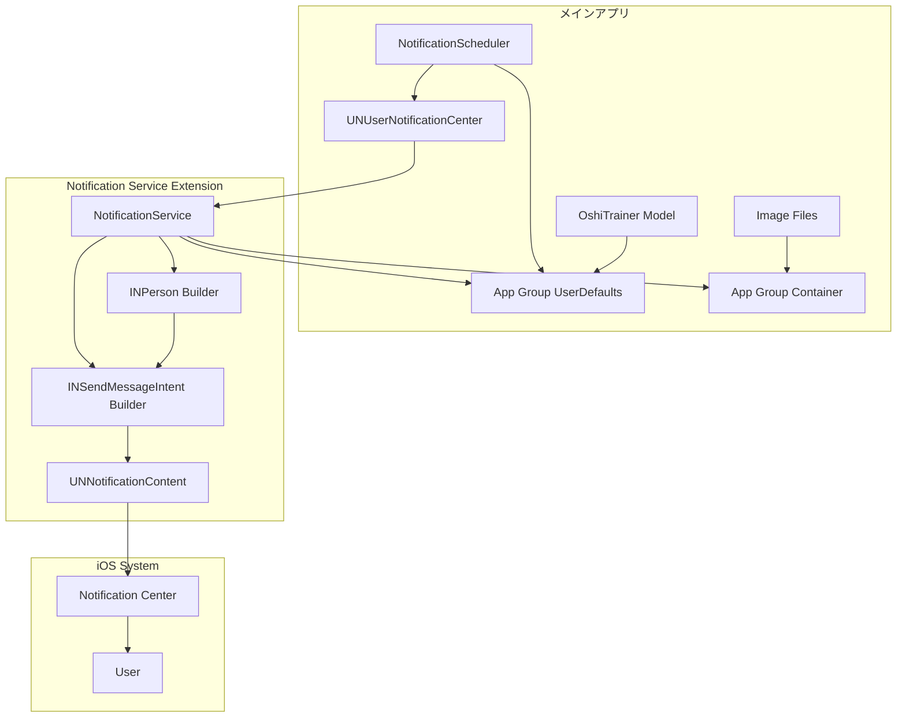
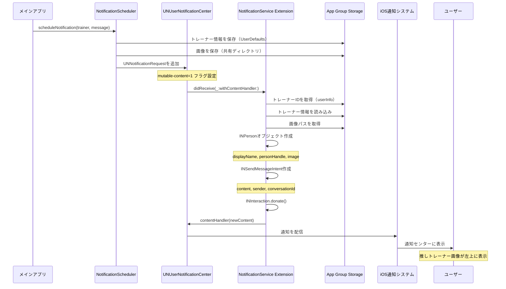
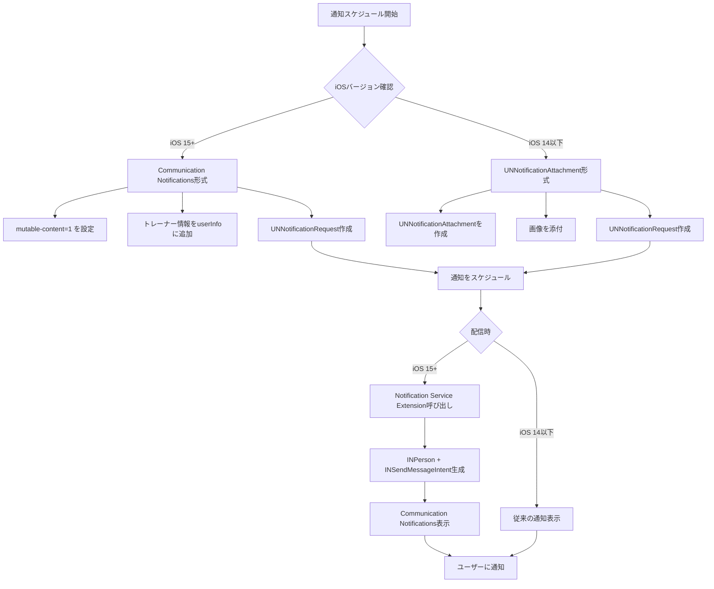
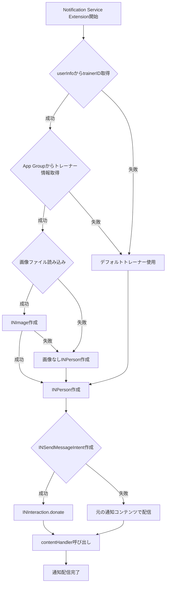
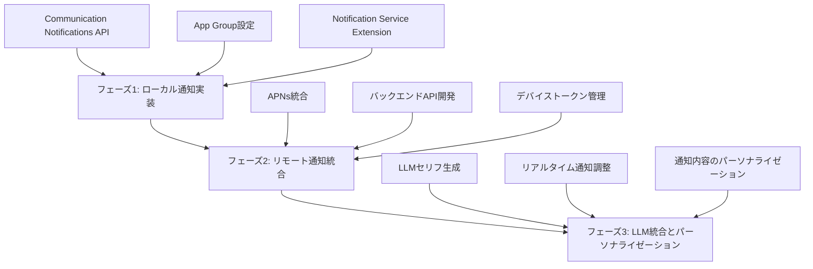

# 技術設計書

## 概要

本機能は、iOS 15+の**Communication Notifications API**（`INPerson` + `INSendMessageIntent`）を活用し、推しトレーナーアプリの通知表示をLINEのようなメッセージング体験に改善する。

**目的:** 通知センターで推しトレーナーの画像を左上に円形で表示し、ユーザーとトレーナーの感情的絆を強化する。

**対象ユーザー:** 推しトレーナーアプリの全ユーザー（iOS 15+デバイス）

**影響:** 既存の`UNNotificationAttachment`ベースの通知システムを、Communication Notifications APIベースの実装に置き換える。iOS 14以下のデバイスは従来の表示形式を維持する。

### ゴール

- 通知センターで推しトレーナーの画像が左上に円形で表示される（LINEライクな表示）
- 推しトレーナーの名前が送信者として表示される
- アプリアイコンが右下に小さく表示される
- 既存の通知機能（スケジューリング、メッセージパーソナライゼーション、アナリティクス）との後方互換性を維持
- iOS 14以下デバイスでの従来表示形式のフォールバック

### 非ゴール

- リアルタイム双方向メッセージング機能（将来のLLM統合で対応）
- プッシュ通知のリモート配信（現在はローカル通知のみ）
- 通知からの直接返信機能
- グループ会話やスレッド機能

## アーキテクチャ

### 既存アーキテクチャ分析

現在、推しトレーナーアプリには通知システムが実装されていないため、本機能は**新規実装**となる。既存のアーキテクチャパターンは以下の通り：

- **MVVM アーキテクチャ**: SwiftUIベースのViewとObservableObjectのViewModel
- **プロトコル指向設計**: `DataServiceProtocol`による抽象化レイヤー
- **Feature-Based モジュール化**: `Features/`配下に機能別ディレクトリ
- **データ永続化**: UserDefaults（`UserDefaultsDataService`）とファイルシステム（`ImagePersistenceService`）

### 高レベルアーキテクチャ



**アーキテクチャ統合:**
- **既存パターン保持**: MVVMアーキテクチャ、プロトコル指向設計を維持
- **新規コンポーネント**:
  - `NotificationScheduler`: 通知スケジューリング管理（`Services/Notifications/`配下）
  - `NotificationService`: Notification Service Extension（新規ターゲット）
  - `INPersonBuilder`: INPersonオブジェクト生成ユーティリティ
  - `INSendMessageIntentBuilder`: INSendMessageIntent生成ユーティリティ
- **技術選択**: iOS標準のUserNotificationsフレームワーク + Intentsフレームワーク
- **ステアリング準拠**: `structure.md`のFeature-Based Modularizationに準拠し、`Services/Notifications/`配下に配置

### 技術選択とアライメント

本機能は既存システムへの**拡張**であり、新規通知システムの構築となる。以下の既存技術スタックと完全に整合する：

**既存技術スタックとの整合**:
- **SwiftUI + MVVM**: 既存のアーキテクチャパターンを踏襲
- **UserDefaults + FileManager**: `UserDefaultsDataService`と`ImagePersistenceService`の既存パターンを活用
- **プロトコル指向**: `NotificationServiceProtocol`を定義し、テスタビリティを確保

**新規導入ライブラリ**:
- **Intents framework** (`import Intents`): iOS標準フレームワーク、追加インストール不要
- **UserNotifications framework** (`import UserNotifications`): iOS標準フレームワーク、既存プロジェクトに含まれる

**パターンからの逸脱なし**: 既存のFeature-Based Modularization、Service Layer Abstraction、Protocol-Oriented Programmingパターンに準拠

### 主要設計決定

#### 決定1: App Group による Extension間データ共有

**決定**: App Groupを使用してメインアプリとNotification Service Extension間でデータを共有する

**コンテキスト**: Notification Service Extensionはメインアプリとは別プロセスで動作するため、通常のUserDefaultsやファイルシステムへのアクセスができない。推しトレーナーの情報（名前、画像パス、ID）を通知加工時に取得する必要がある。

**代替案**:
1. **UserInfo辞書に全データを埋め込む**: 通知ペイロード内に全データを含める
2. **App Group共有ストレージ**: UserDefaultsとファイルシステムを共有
3. **外部データベース（Core Data）**: 共有データベースを使用

**選択したアプローチ**: App Group共有ストレージ（UserDefaults + 共有ディレクトリ）

**理由**:
- **既存パターンとの整合性**: 既存の`UserDefaultsDataService`と`ImagePersistenceService`を最小限の変更で拡張可能
- **データサイズ制限回避**: UserInfo辞書には4KBの制限があり、画像データを含めることは不可能
- **シンプルさ**: Core Dataの導入はオーバーエンジニアリング。現在のデータ規模（トレーナー数〜10人）ではUserDefaultsで十分
- **パフォーマンス**: Extension実行時間制限（30秒）内で高速にアクセス可能

**トレードオフ**:
- **獲得**: 既存コードの再利用、実装コストの削減、メンテナンス性の向上
- **犠牲**: 将来的にトレーナー数が100人以上になった場合、Core Dataへの移行が必要になる可能性

#### 決定2: iOS バージョン別フォールバック戦略

**決定**: iOS 15+ではCommunication Notifications API、iOS 14以下ではUNNotificationAttachmentベースの従来実装を使用

**コンテキスト**: Communication Notifications APIはiOS 15+でのみ利用可能。現在のアプリのDeployment TargetはiOS 16.0だが、将来的にiOS 14以下をサポートする可能性がある。

**代替案**:
1. **iOS 15+のみサポート**: 通知機能をiOS 15+に限定
2. **デュアル実装**: iOSバージョンに応じて異なる通知生成ロジックを使い分け
3. **Communication Notificationsのみ**: iOS 14以下では通知を無効化

**選択したアプローチ**: デュアル実装（iOSバージョン別フォールバック）

**理由**:
- **ユーザーベース保護**: iOS 14以下のユーザーも通知機能を利用可能
- **段階的移行**: 新しいAPIを優先しつつ、古いデバイスのサポートを維持
- **柔軟性**: 将来的にDeployment Targetを下げる際の対応コストを削減

**トレードオフ**:
- **獲得**: 幅広いユーザーベースのサポート、柔軟な移行戦略
- **犠牲**: コードの複雑性が若干増加、テストケースの追加が必要

#### 決定3: Notification Service Extension でのエラーハンドリング戦略

**決定**: 画像取得失敗時は画像なしINPersonオブジェクトで継続し、通知配信を保証する

**コンテキスト**: Notification Service Extensionには30秒の実行時間制限とメモリ制限（24MB）がある。画像読み込みやINPerson作成に失敗した場合、通知配信を停止するか、フォールバック処理を実行するか選択する必要がある。

**代替案**:
1. **エラー時は通知配信中止**: 不完全な通知を表示しない
2. **フォールバック処理**: 画像なしで通知を配信
3. **デフォルト画像使用**: アプリアイコンをINPersonの画像として使用

**選択したアプローチ**: フォールバック処理（画像なしで通知配信）

**理由**:
- **通知配信の保証**: ユーザーへの通知は必ず届けることが最優先
- **ユーザー体験の維持**: 画像がなくても、トレーナー名とメッセージは表示される
- **デバッグ可能性**: エラーログを記録し、問題の特定と解決を可能にする

**トレードオフ**:
- **獲得**: 通知配信の信頼性、ユーザー体験の一貫性
- **犠牲**: 不完全な通知が表示される可能性（画像なし）

## システムフロー

### 通知配信フロー（Communication Notifications）



### iOSバージョン別フォールバック処理フロー



## 要件トレーサビリティ

| 要件 | 要件概要 | コンポーネント | インターフェース | フロー |
|------|----------|----------------|------------------|--------|
| 1 | Communication Notifications Capability有効化 | Xcodeプロジェクト設定 | Entitlements | - |
| 2 | Notification Service Extension作成 | NotificationService | didReceive(_:withContentHandler:) | 通知配信フロー |
| 3 | INPersonオブジェクト生成 | INPersonBuilder | createINPerson(from:) | 通知配信フロー |
| 4 | INSendMessageIntent生成 | INSendMessageIntentBuilder | createIntent(person:content:) | 通知配信フロー |
| 5 | 既存通知サービスとの統合 | NotificationScheduler | scheduleNotification(_:) | 通知配信フロー |
| 6 | 画像リソース管理 | ImagePersistenceService | loadImage(fileName:) | 通知配信フロー |
| 7 | iOSバージョン別フォールバック | NotificationScheduler | iOSVersionBasedStrategy() | フォールバック処理フロー |
| 8 | App Group設定 | App Group Capability | UserDefaults(suiteName:) | 通知配信フロー |
| 9 | 通知カテゴリとユーザーインタラクション | AppDelegate | userNotificationCenter(_:didReceive:) | - |
| 10 | デバッグとトラブルシューティング | NotificationService | OSLog | 通知配信フロー |
| 11 | 将来のカスタムトレーナー拡張対応 | INPersonBuilder | 柔軟な画像パス解決 | - |
| 12 | アクセシビリティ | INPerson | displayName, accessibilityLabel | - |

## コンポーネントとインターフェース

### 通知管理レイヤー

#### NotificationScheduler

**責任と境界**
- **主要責任**: 通知のスケジューリングと管理を行う
- **ドメイン境界**: 通知機能ドメイン
- **データ所有権**: 通知スケジュール情報、通知設定
- **トランザクション境界**: 通知スケジューリング操作は単一トランザクション

**依存関係**
- **インバウンド**: HomeViewModel、SettingsViewModel（将来）
- **アウトバウンド**: UNUserNotificationCenter、App Group UserDefaults、ImagePersistenceService
- **外部**: UserNotifications framework、Intents framework

**契約定義（サービスインターフェース）**

```swift
protocol NotificationSchedulerProtocol {
    /// 通知をスケジュールする
    /// - Parameters:
    ///   - trainer: 通知を送信する推しトレーナー
    ///   - message: 通知メッセージ本文
    ///   - triggerDate: 通知配信日時
    /// - Returns: 成功時はnotificationID、失敗時はエラー
    func scheduleNotification(
        trainer: OshiTrainerTemplate,
        message: String,
        triggerDate: Date
    ) -> Result<String, NotificationError>

    /// スケジュール済み通知を取得
    func getPendingNotifications() -> [UNNotificationRequest]

    /// 通知をキャンセル
    func cancelNotification(id: String)

    /// 全通知をキャンセル
    func cancelAllNotifications()
}

enum NotificationError: Error {
    case permissionDenied
    case schedulingFailed(Error)
    case invalidTrainerData
    case imageLoadFailed
}
```

- **事前条件**: 通知権限が許可されていること、トレーナーデータが有効であること
- **事後条件**: 通知がUNUserNotificationCenterに登録され、指定日時に配信される
- **不変条件**: トレーナーIDは一意であり、通知IDと紐付けられる

**統合戦略**
- **修正アプローチ**: 新規実装（既存の通知システムは存在しないため）
- **後方互換性**: iOS 14以下向けのフォールバック実装を含む
- **移行パス**: 段階的リリース。まずiOS 15+で動作確認後、iOS 14以下のフォールバック実装を追加

#### NotificationService (Notification Service Extension)

**責任と境界**
- **主要責任**: 通知配信前にコンテンツを加工し、INSendMessageIntentに変換する
- **ドメイン境界**: 通知表示加工ドメイン
- **データ所有権**: 通知コンテンツの一時的な加工データ
- **トランザクション境界**: 単一通知の加工処理（30秒以内）

**依存関係**
- **インバウンド**: UNUserNotificationCenter（iOSシステム）
- **アウトバウンド**: App Group UserDefaults、INPersonBuilder、INSendMessageIntentBuilder
- **外部**: UserNotifications framework、Intents framework

**外部依存関係調査**:
- **Intents framework**: iOS標準フレームワーク、追加インストール不要
  - `INPerson`: 送信者情報を表現するクラス。`displayName`、`personHandle`（識別子）、`image`（INImage）プロパティを持つ
  - `INSendMessageIntent`: メッセージ送信インテントを表現するクラス。`content`（メッセージ本文）、`sender`（INPerson）、`conversationIdentifier`プロパティを持つ
  - `INImage`: 画像データを表現するクラス。`imageData`または`imageURL`から初期化可能
  - バージョン互換性: iOS 10+で利用可能、Communication Notifications統合はiOS 15+
  - 認証: 不要（ローカル通知のため）
  - レート制限: なし
  - 公式ドキュメント: https://developer.apple.com/documentation/intents
- **UserNotifications framework**: iOS標準フレームワーク
  - `UNNotificationServiceExtension`: Extensionの基底クラス
  - `didReceive(_:withContentHandler:)`: 通知加工エントリーポイント
  - 実行時間制限: 30秒
  - メモリ制限: 24MB
  - 公式ドキュメント: https://developer.apple.com/documentation/usernotifications

**契約定義（Extension エントリーポイント）**

```swift
class NotificationService: UNNotificationServiceExtension {
    /// 通知を受信し、コンテンツを加工する
    /// - Parameters:
    ///   - request: 通知リクエスト
    ///   - contentHandler: 加工後のコンテンツを返すコールバック
    override func didReceive(
        _ request: UNNotificationRequest,
        withContentHandler contentHandler: @escaping (UNNotificationContent) -> Void
    )

    /// タイムアウト時のフォールバック処理
    override func serviceExtensionTimeWillExpire()
}
```

- **事前条件**: 通知ペイロードに`mutable-content=1`フラグが設定されていること
- **事後条件**: INSendMessageIntentが適用されたUNNotificationContentが返される
- **不変条件**: 元の通知コンテンツ（title、body）は保持される

**状態管理**
- **状態モデル**: ステートレス（各通知は独立して処理）
- **永続化**: 不要（一時的な加工処理のみ）
- **並行性**: 各通知は独立したExtensionプロセスで処理されるため、並行性制御不要

### ユーティリティレイヤー

#### INPersonBuilder

**責任と境界**
- **主要責任**: OshiTrainerTemplateからINPersonオブジェクトを生成する
- **ドメイン境界**: 通知表示加工ドメイン
- **データ所有権**: なし（変換ユーティリティ）

**契約定義（ユーティリティインターフェース）**

```swift
struct INPersonBuilder {
    /// トレーナー情報からINPersonオブジェクトを作成
    /// - Parameter trainer: 推しトレーナーテンプレート
    /// - Returns: 成功時はINPerson、失敗時はエラー
    static func createINPerson(
        from trainer: OshiTrainerTemplate
    ) -> Result<INPerson, INPersonBuildError>

    /// 画像ファイルパスからINImageを作成
    /// - Parameter imagePath: 画像ファイルパス
    /// - Returns: 成功時はINImage、失敗時はnil
    static func createINImage(
        from imagePath: String
    ) -> INImage?
}

enum INPersonBuildError: Error {
    case invalidTrainerData
    case imageLoadFailed
}
```

#### INSendMessageIntentBuilder

**責任と境界**
- **主要責任**: INPersonとメッセージ本文からINSendMessageIntentを生成する
- **ドメイン境界**: 通知表示加工ドメイン
- **データ所有権**: なし（変換ユーティリティ）

**契約定義（ユーティリティインターフェース）**

```swift
struct INSendMessageIntentBuilder {
    /// INSendMessageIntentを作成
    /// - Parameters:
    ///   - person: 送信者（INPerson）
    ///   - content: メッセージ本文
    ///   - conversationId: 会話識別子
    /// - Returns: INSendMessageIntent
    static func createIntent(
        person: INPerson,
        content: String,
        conversationId: String
    ) -> INSendMessageIntent

    /// INInteractionを作成してdonateする
    /// - Parameter intent: INSendMessageIntent
    static func donateInteraction(for intent: INSendMessageIntent)
}
```

## データモデル

### 物理データモデル

#### App Group UserDefaults

本機能では、App Group共有UserDefaultsを使用してメインアプリとNotification Service Extension間でデータを共有する。

**保存キー構造**:
```swift
// 選択中のトレーナーID
"selectedTrainerId": String (UUID)

// 全トレーナーテンプレート（既存のUserDefaultsDataServiceと同じキー）
"trainerTemplates": [OshiTrainerTemplate] (JSON)
```

**App Group ID**: `group.com.yourcompany.VirtualTrainer`

**データアクセスパターン**:
```swift
// メインアプリ側
let appGroupDefaults = UserDefaults(suiteName: "group.com.yourcompany.VirtualTrainer")
appGroupDefaults?.set(trainerId.uuidString, forKey: "selectedTrainerId")

// Notification Service Extension側
let appGroupDefaults = UserDefaults(suiteName: "group.com.yourcompany.VirtualTrainer")
let trainerId = appGroupDefaults?.string(forKey: "selectedTrainerId")
```

#### App Group 共有ディレクトリ

トレーナー画像は既存の`ImagePersistenceService`を拡張し、App Group共有ディレクトリに保存する。

**ディレクトリ構造**:
```
App Group Container/
└── TrainerImages/
    ├── <UUID>.png
    ├── <UUID>.png
    └── ...
```

**画像パス解決**:
```swift
// App Groupコンテナのパス取得
let containerURL = FileManager.default.containerURL(
    forSecurityApplicationGroupIdentifier: "group.com.yourcompany.VirtualTrainer"
)

// 画像ディレクトリパス
let imagesDirectory = containerURL?.appendingPathComponent("TrainerImages")
```

### データ契約と統合

#### 通知ペイロード（UserInfo）

メインアプリからNotification Service Extensionに渡すデータ構造:

```json
{
  "trainerId": "UUID文字列",
  "notificationId": "通知ID",
  "slotType": "morning|afternoon|evening|night",
  "category": "TRAINING_INVITATION"
}
```

**バリデーション規則**:
- `trainerId`: 有効なUUID形式の文字列
- `notificationId`: 一意の通知識別子
- `category`: 既存の通知カテゴリと同一

**シリアライゼーション形式**: JSON（UserInfoディクショナリ）

#### イベントスキーマ

本機能では外部イベントは発行しないが、将来的な拡張を考慮してイベント設計を記載する。

**発行イベント**:
- `NotificationScheduled`: 通知がスケジュールされた
- `NotificationDelivered`: 通知が配信された（iOS通知システムからのコールバック）
- `NotificationTapped`: ユーザーが通知をタップした

**イベントスキーマ**:
```json
{
  "eventType": "NotificationScheduled|NotificationDelivered|NotificationTapped",
  "trainerId": "UUID文字列",
  "notificationId": "通知ID",
  "timestamp": "ISO8601形式のタイムスタンプ"
}
```

#### クロスサービスデータ管理

**分散トランザクションパターン**: 不要（ローカル通知のみ）

**データ同期戦略**: App Group UserDefaultsによる即時共有

**結果整合性ハンドリング**:
- メインアプリでトレーナーデータ更新後、即座にApp Group UserDefaultsに反映
- Notification Service Extension側では最新データを読み込み

## エラーハンドリング

### エラー戦略

通知システムにおけるエラーは、**通知配信の保証**を最優先とし、段階的なフォールバック処理を実行する。

**エラーカテゴリと対応**:
- **ユーザーエラー**: 通知権限拒否 → 設定画面へのガイダンス表示
- **システムエラー**: Extension実行タイムアウト → 元の通知コンテンツで配信
- **ビジネスロジックエラー**: トレーナーデータ不整合 → デフォルトトレーナー情報で代替

### エラーカテゴリと対応

#### ユーザーエラー (4xx相当)

| エラー | 原因 | 対応 |
|--------|------|------|
| NotificationPermissionDenied | 通知権限が拒否されている | 設定画面への誘導ダイアログ表示 |
| InvalidTrainerData | トレーナーデータが不正 | デフォルトトレーナー「推乃 愛」で代替 |

#### システムエラー (5xx相当)

| エラー | 原因 | 対応 |
|--------|------|------|
| ExtensionTimeout | Extension実行時間30秒超過 | 元の通知コンテンツで配信（フォールバック） |
| ImageLoadFailed | 画像ファイル読み込み失敗 | 画像なしINPersonで通知配信 |
| AppGroupAccessFailed | App Groupストレージアクセス失敗 | デフォルトトレーナー情報で代替 |

#### ビジネスロジックエラー (422相当)

| エラー | 原因 | 対応 |
|--------|------|------|
| TrainerNotFound | 指定されたトレーナーIDが存在しない | デフォルトトレーナー「推乃 愛」で代替 |
| INPersonCreationFailed | INPersonオブジェクト作成失敗 | 画像なしINPersonで再試行 |

### エラーハンドリングフロー



### モニタリング

**エラートラッキング**:
- **OSLog**: Notification Service Extension内でのエラーログ記録
- **ログレベル**: `.error`（エラー）、`.warning`（警告）、`.info`（情報）
- **ログフォーマット**: `[NotificationService] [エラーカテゴリ] メッセージ`

**ヘルスモニタリング**:
- 通知配信成功率の監視（将来のアナリティクス統合）
- Extension実行時間の監視（平均実行時間、タイムアウト率）
- 画像読み込み失敗率の監視

**ログ出力例**:
```swift
import OSLog

let logger = Logger(subsystem: "com.yourcompany.VirtualTrainer", category: "NotificationService")

logger.error("[NotificationService] [ImageLoadFailed] Failed to load image: \(imagePath)")
logger.warning("[NotificationService] [TrainerNotFound] Trainer not found, using default: \(trainerId)")
logger.info("[NotificationService] [Success] Communication notification created for: \(trainerName)")
```

## テスト戦略

### ユニットテスト

#### 通知スケジューリングロジック (NotificationScheduler)
- `testScheduleNotification_withValidTrainer_shouldCreateNotificationRequest`
- `testScheduleNotification_withoutPermission_shouldReturnPermissionDeniedError`
- `testScheduleNotification_withInvalidTrainerData_shouldReturnInvalidTrainerDataError`
- `testCancelNotification_withValidId_shouldRemoveNotificationRequest`
- `testGetPendingNotifications_shouldReturnScheduledNotifications`

#### INPersonBuilder
- `testCreateINPerson_withValidTrainer_shouldReturnINPerson`
- `testCreateINPerson_withMissingImage_shouldReturnINPersonWithoutImage`
- `testCreateINImage_withValidImagePath_shouldReturnINImage`
- `testCreateINImage_withInvalidImagePath_shouldReturnNil`

#### INSendMessageIntentBuilder
- `testCreateIntent_withValidParameters_shouldReturnINSendMessageIntent`
- `testDonateInteraction_shouldCallDonateMethod`

### 統合テスト

#### App Group データ共有
- `testAppGroupUserDefaults_shouldShareDataBetweenTargets`
- `testImagePersistenceService_shouldSaveAndLoadFromAppGroupContainer`
- `testNotificationExtension_shouldAccessTrainerDataFromAppGroup`

#### 通知配信フロー（エンドツーエンド）
- `testNotificationDelivery_iOS15Plus_shouldDisplayCommunicationNotification`
- `testNotificationDelivery_iOS14_shouldDisplayAttachmentNotification`
- `testNotificationTap_shouldTriggerAppDelegateHandler`

### UIテスト

本機能は通知システムであり、UIテストは対象外（通知センターの表示は手動テスト）

### パフォーマンス/負荷テスト

#### Notification Service Extension実行時間
- `testExtensionExecutionTime_shouldCompleteWithin30Seconds`
- `testImageLoadPerformance_shouldLoadImageUnder1Second`
- `testINPersonCreation_shouldCreateObjectUnder500Milliseconds`

#### 並行通知処理
- `testMultipleNotifications_shouldProcessConcurrently`
- `testHighVolumeNotifications_shouldHandleWithoutMemoryIssues`（24MB制限内での動作確認）

## セキュリティ考慮事項

### 脅威モデリング

**脅威1: トレーナー画像の不正アクセス**
- **シナリオ**: 他のアプリがApp Groupコンテナにアクセスし、トレーナー画像を取得
- **影響**: プライバシー侵害（ユーザーがアップロードした画像の漏洩）
- **緩和策**: App GroupはApple Developer IDで署名されたアプリのみアクセス可能。entitlementsによるアクセス制御

**脅威2: 通知ペイロード改竄**
- **シナリオ**: ローカル通知のため、外部からの改竄リスクは低い
- **影響**: 低（ローカル通知のみ）
- **緩和策**: 不要（リモート通知実装時に再検討）

### セキュリティコントロール

**データ保護**:
- **App Group共有データ**: iOSのサンドボックスメカニズムにより保護
- **画像ファイル**: App Groupコンテナ内に保存、同一App Group IDを持つターゲットのみアクセス可能

**認証と認可**:
- 不要（ローカル通知のみ、外部APIなし）

### コンプライアンス要件

**プライバシー**:
- **個人情報**: トレーナー名、画像はユーザーが作成したデータ
- **データ保存期間**: 無期限（ユーザーがトレーナーを削除するまで）
- **ユーザー同意**: アプリ初回起動時に通知権限を要求
- **データ削除**: トレーナー削除時に画像ファイルも削除

**Appleガイドライン準拠**:
- Communication Notificationsの使用は、Appleの「メッセージングアプリ」としてのガイドラインに準拠
- 通知内容はユーザーが期待する「推しトレーナーからのメッセージ」として適切に表現

## パフォーマンスとスケーラビリティ

### ターゲットメトリクス

| メトリクス | 目標値 | 測定方法 |
|------------|--------|----------|
| Extension実行時間 | < 2秒（平均） | OSLog + Instruments |
| 画像読み込み時間 | < 500ms | パフォーマンステスト |
| 通知配信成功率 | > 99% | アナリティクス |
| メモリ使用量 | < 10MB（24MB制限の50%以下） | Instruments Memory Graph |

### スケーリングアプローチ

**水平スケーリング**: 不要（ローカル通知のみ、サーバー負荷なし）

**垂直スケーリング**:
- トレーナー数が100人以上になった場合、Core Dataへの移行を検討
- 現在の想定（〜10人）ではUserDefaultsで十分

### キャッシング戦略

**画像キャッシュ**:
- Notification Service Extension内では、毎回ファイルシステムから画像を読み込む
- 画像はApp Groupコンテナに永続化されているため、追加のキャッシュは不要

**トレーナーデータキャッシュ**:
- App Group UserDefaultsから読み込むため、追加のキャッシュは不要
- UserDefaults自体がメモリキャッシュを持つ

### 最適化技術

**画像最適化**:
- 推奨画像サイズ: 200x200px（正方形）
- PNG形式、透過対応
- ファイルサイズ: < 100KB（通知表示用）

**非同期処理**:
- 画像読み込みは同期処理（Extension実行時間制限内で完了）
- INPerson作成も同期処理（軽量オブジェクト）

## 移行戦略

本機能は新規実装のため、既存システムからの移行は不要。ただし、将来的にリモート通知やLLM統合を実装する際の拡張性を考慮した設計とする。

### フェーズ別移行計画



### ロールバックトリガー

**ロールバック条件**:
- 通知配信成功率が90%以下に低下した場合
- Extension実行タイムアウト率が10%以上になった場合
- 重大なプライバシー侵害が発見された場合

**ロールバック手順**:
1. 通知スケジューリングを一時停止
2. 既存の通知をキャンセル
3. Communication Notifications Capabilityを無効化
4. 従来のUNNotificationAttachmentベースの実装に戻す

### バリデーションチェックポイント

**マイルストーン1: 基本実装完了**
- [ ] Notification Service Extension動作確認
- [ ] INPerson + INSendMessageIntent生成確認
- [ ] App Groupデータ共有確認

**マイルストーン2: 統合テスト完了**
- [ ] iOS 15+での通知表示確認
- [ ] iOS 14以下でのフォールバック確認
- [ ] 通知タップからのアプリ起動確認

**マイルストーン3: 本番リリース**
- [ ] パフォーマンステスト合格
- [ ] セキュリティレビュー合格
- [ ] Appleレビュー合格
