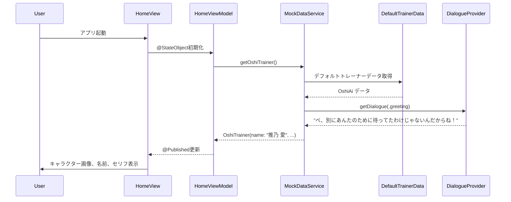
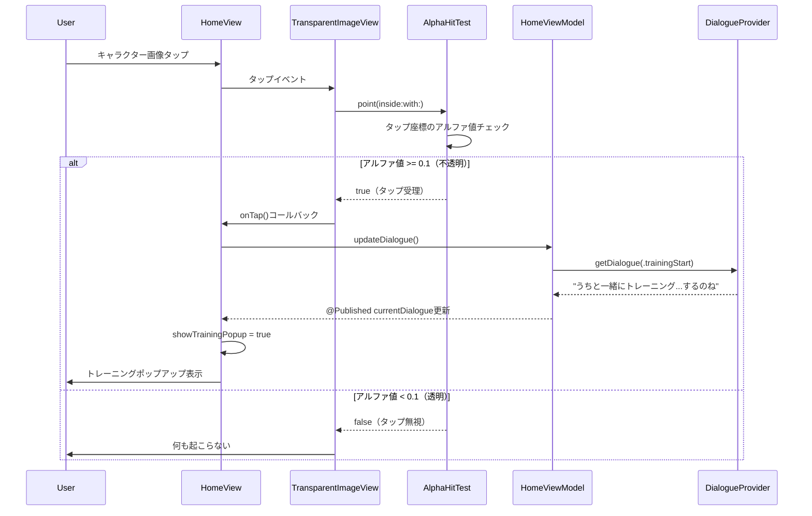

# Technical Design Document

## Overview

デフォルト推しトレーナー「推乃 愛（オシノ アイ）」機能は、推しトレーナー作成機能が実装されるまでの間、ユーザーが初回起動時から魅力的なキャラクターとの交流を体験できるようにします。この機能は、既存の`OshiTrainer`モデルと`MockDataService`を活用し、ツンデレ性格のキャラクターによるテンプレートセリフと背景透過済み画像によるインタラクティブなホーム画面体験を提供します。

ユーザーは、ホーム画面で推乃 愛のキャラクター画像、名前、ツンデレな性格を反映したセリフを見ることができ、キャラクター画像をタップすることでトレーニングを開始できます。透過画像の不透明部分のみがタップ可能な領域として機能し、自然なインタラクション体験を実現します。

### Goals

- デフォルトトレーナー「推乃 愛」のキャラクターデータを定義し、ホーム画面に統合する
- ツンデレ性格（一人称「うち」、二人称「あんた」）を反映したテンプレートセリフを提供する
- 背景透過済み画像の不透明部分のみをタップ可能にする精密なヒット判定を実装する
- 既存の`MockDataService`と`HomeView`/`HomeViewModel`を最小限の変更で拡張する
- 将来的なカスタムトレーナー作成機能への移行を容易にする設計を維持する

### Non-Goals

- LLMを用いた動的なセリフ生成（将来機能として予約）
- 複数のデフォルトトレーナーの選択機能
- キャラクターのアニメーションや音声再生
- トレーナーの性格パラメータのデータモデル化（現時点ではテンプレートセリフで表現）

## Architecture

### Existing Architecture Analysis

現在のOshi-Trainerアプリは以下のアーキテクチャパターンを採用しています：

- **MVVM（Model-View-ViewModel）パターン**: SwiftUIによる宣言的UI構築と`@StateObject`/`@Published`による状態管理
- **プロトコル指向設計**: `DataServiceProtocol`によるデータアクセス層の抽象化
- **機能別モジュール化**: `Features/`ディレクトリ配下に`Home/`, `LevelDetail/`, `Statistics/`などを配置
- **共有コンポーネント**: `Shared/`配下にウマ娘風カスタムスタイル（`Color+Oshi`, `OshiButtonStyle`, `OshiTextStyles`）を配置

**既存の統合ポイント**:
- `HomeView`: キャラクター画像、セリフ、レベル表示を含むメイン画面
- `HomeViewModel`: `DataServiceProtocol`を通じて`OshiTrainer`データを取得し、セリフ更新を管理
- `MockDataService`: `getOshiTrainer()`メソッドで現在プレースホルダーデータを返す
- `OshiTrainer`モデル: 名前、レベル、経験値、画像名、セリフを保持

### High-Level Architecture

```mermaid
graph TB
    HomeView[HomeView - SwiftUI]
    HomeViewModel[HomeViewModel - ObservableObject]
    MockDataService[MockDataService - DataServiceProtocol]
    OshiTrainer[OshiTrainer Model]
    DefaultTrainerData[DefaultOshiTrainerData - Static Constants]
    DialogueTemplate[DialogueTemplateProvider - Tsundere Dialogues]
    CharacterImage[OshiAi.png - Transparent Asset]
    HitTestHelper[TransparentImageHitTest - Alpha-Based Detection]

    HomeView -->|@StateObject| HomeViewModel
    HomeViewModel -->|getOshiTrainer| MockDataService
    MockDataService -->|returns| OshiTrainer
    MockDataService -->|loads data from| DefaultTrainerData
    HomeViewModel -->|getDialogue| DialogueTemplate
    HomeView -->|loads image| CharacterImage
    HomeView -->|hit test| HitTestHelper
```

### Technology Alignment

この機能は既存のOshi-Trainerアプリの技術スタックに完全に準拠します：

- **SwiftUI**: 宣言的UI構築とネイティブコンポーネント
- **Swift 6.x**: プロトコル指向プログラミングと型安全性
- **MVVM パターン**: `HomeView` (View) - `HomeViewModel` (ViewModel) - `MockDataService` (Model/Service)
- **Combine Framework**: `@Published`プロパティによるリアクティブデータフロー
- **Assets.xcassets**: 画像アセット管理（背景透過PNG）

**新規導入要素**:
- `DefaultOshiTrainerData`: デフォルトトレーナーの定数データ
- `DialogueTemplateProvider`: ツンデレセリフテンプレート管理
- `TransparentImageHitTest`: アルファチャンネルベースのヒット判定ヘルパー

### Key Design Decisions

#### Decision 1: テンプレートセリフのデータ構造とランダム選択

**Context**: ツンデレ性格（一人称「うち」、二人称「あんた」）を反映したセリフを、状況に応じて表示する必要があります。将来的にLLMで動的生成する予定ですが、現時点ではテンプレートセリフで実装します。

**Alternatives**:
1. **単一配列でランダム選択**: すべてのセリフを1つの配列に格納し、ランダムに選択
2. **状況別カテゴリー分類**: トレーニング開始、応援、照れ隠しなどカテゴリーごとに配列を分けて管理
3. **重み付きランダム選択**: セリフに重みを付けて出現頻度を調整

**Selected Approach**: 状況別カテゴリー分類（オプション2）

```swift
struct DialogueTemplateProvider {
    enum DialogueCategory {
        case greeting      // 初回・日常挨拶
        case trainingStart // トレーニング開始時
        case encouragement // 応援・励まし
        case shyReaction   // 照れ隠し・ツンデレ反応
    }

    static func getDialogue(for category: DialogueCategory) -> String {
        // カテゴリーごとのセリフ配列からランダム選択
    }
}
```

**Rationale**:
- 将来的にLLM統合時に、状況コンテキストをプロンプトとして渡しやすい
- ホーム画面表示時、トレーニング開始時など、UIイベントに応じた適切なセリフを選択可能
- セリフのバリエーション管理が容易で、追加・修正が簡単

**Trade-offs**:
- 利点: 将来のLLM統合への移行が容易、コンテキストに応じたセリフ選択が可能
- 欠点: 単純なランダム選択より実装が若干複雑（ただし、将来の拡張性を考慮すると許容範囲）

#### Decision 2: 透過画像のヒット判定実装方法

**Context**: 背景透過済みPNG画像のキャラクター部分のみをタップ可能にし、透明部分はタップを無視する必要があります。SwiftUIの標準的なButtonやTapGestureでは矩形領域全体がタップ可能になってしまいます。

**Alternatives**:
1. **UIViewRepresentable + UIImageView**: UIKitの`point(inside:with:)`をオーバーライドしてアルファ値をチェック
2. **SwiftUI Custom Shape + Path**: キャラクターの輪郭をPathで定義し、`.contentShape()`で指定
3. **AsyncImage + DragGesture**: タップ座標を取得してCGImageのピクセルデータからアルファ値を判定

**Selected Approach**: UIViewRepresentable + UIImageView（オプション1）

```swift
struct TransparentImageView: UIViewRepresentable {
    let imageName: String
    let onTap: () -> Void

    func makeUIView(context: Context) -> UIImageView {
        let imageView = AlphaHitTestImageView()
        imageView.image = UIImage(named: imageName)
        imageView.isUserInteractionEnabled = true
        // Add tap gesture recognizer
        return imageView
    }
}

class AlphaHitTestImageView: UIImageView {
    override func point(inside point: CGPoint, with event: UIEvent?) -> Bool {
        guard let image = image else { return false }
        // Check alpha value at touch point
        // Return false if alpha < threshold (e.g., 0.1)
    }
}
```

**Rationale**:
- SwiftUIの`Image`では直接ピクセルデータにアクセスできないため、UIKitの`UIImageView`を活用
- `point(inside:with:)`メソッドでヒット判定をカスタマイズ可能
- CGImageを用いたピクセルアルファ値の取得が確実で、パフォーマンスも許容範囲
- `UIViewRepresentable`でSwiftUIとシームレスに統合

**Trade-offs**:
- 利点: 正確なアルファベースのヒット判定、SwiftUIとの統合が容易
- 欠点: UIKitへの依存が発生、SwiftUI純粋な実装より複雑（ただし、要件を満たすためには必要）

## System Flows

### ホーム画面表示とデフォルトトレーナー読み込みフロー



### キャラクター画像タップとトレーニング開始フロー



## Requirements Traceability

| Requirement | 要件概要 | Components | Interfaces | Flows |
|-------------|----------|------------|------------|-------|
| 1.1 | デフォルトトレーナー「推乃 愛」データ読み込み | MockDataService, DefaultOshiTrainerData | `getOshiTrainer() -> OshiTrainer` | ホーム画面表示フロー |
| 1.2-1.5 | 名前、一人称、二人称、性格設定の保持 | DefaultOshiTrainerData, DialogueTemplateProvider | `DefaultOshiTrainerData.oshiAi`, `DialogueTemplateProvider.getDialogue()` | - |
| 2.1-2.3 | キャラクター画像表示と配置 | HomeView, Assets.xcassets | `Image("OshiAi")` | ホーム画面表示フロー |
| 2.4 | タップでトレーニングポップアップ表示 | HomeView, TransparentImageView | `onTap: () -> Void` | キャラクタータップフロー |
| 2.5-2.6 | 透過部分のタップ無効化、不透明部分のみタップ可能 | AlphaHitTestImageView | `point(inside:with:) -> Bool` | キャラクタータップフロー |
| 3.1-3.4 | メッセージ表示（名前、セリフ、吹き出しスタイル） | HomeView, HomeViewModel | `currentDialogue: String` | ホーム画面表示フロー |
| 4.1-4.4 | テンプレートセリフ定義（ツンデレ、一人称「うち」、二人称「あんた」） | DialogueTemplateProvider | `getDialogue(for:) -> String` | 両フロー |
| 5.1-5.4 | MockDataService統合とOshiTrainerモデル | MockDataService, OshiTrainer | `getOshiTrainer() -> OshiTrainer` | ホーム画面表示フロー |
| 6.1-6.4 | ホーム画面統合表示 | HomeView | - | ホーム画面表示フロー |

## Components and Interfaces

### Data Layer

#### DefaultOshiTrainerData

**Responsibility & Boundaries**
- **Primary Responsibility**: デフォルト推しトレーナー「推乃 愛」の定数データを提供する
- **Domain Boundary**: データ層（Models/）配下、純粋なSwift構造体として定義
- **Data Ownership**: デフォルトトレーナーの静的データ（名前、レベル、経験値、画像名）

**Dependencies**
- **Inbound**: `MockDataService`
- **Outbound**: なし（純粋な定数データ）
- **External**: なし

**Contract Definition**

```swift
struct DefaultOshiTrainerData {
    static let oshiAi = OshiTrainer(
        name: "推乃 愛",
        level: 1,
        experience: 0,
        imageName: "OshiAi",  // Assets.xcassetsに配置する透過PNG
        currentDialogue: ""   // DialogueTemplateProviderから取得
    )
}
```

**Preconditions**: なし（静的定数）
**Postconditions**: 常に一貫したデフォルトトレーナーデータを返す
**Invariants**: `name`は常に"推乃 愛"、`level`は1、`experience`は0

#### DialogueTemplateProvider

**Responsibility & Boundaries**
- **Primary Responsibility**: ツンデレ性格を反映したテンプレートセリフを状況に応じて提供する
- **Domain Boundary**: サービス層（Services/）配下、純粋関数として実装
- **Data Ownership**: セリフテンプレート文字列の定義と管理

**Dependencies**
- **Inbound**: `MockDataService`, `HomeViewModel`
- **Outbound**: なし
- **External**: なし

**Contract Definition**

```swift
struct DialogueTemplateProvider {
    enum DialogueCategory {
        case greeting       // 初回・日常挨拶
        case trainingStart  // トレーニング開始時
        case encouragement  // 応援・励まし
        case shyReaction    // 照れ隠し・ツンデレ反応
    }

    static func getDialogue(for category: DialogueCategory) -> String
}
```

**セリフ定義例**:
- `greeting`: "べ、別にあんたのために待ってたわけじゃないんだからね！", "おはよう...って、うちが言いたかったのよ", "今日も...一緒にトレーニングするの？"
- `trainingStart`: "うちと一緒にトレーニング...するのね", "別に嬉しくなんかないんだから！でも...頑張りなさいよ", "あんたのためじゃなくて、うちが付き合ってあげるだけよ"
- `encouragement`: "もっと頑張れるでしょ、あんたなら", "うちが見てるから...手を抜かないでよね", "すごい...じゃなくて、当然よね！"
- `shyReaction`: "べ、別に心配なんかしてないんだからね", "あんたのこと考えて...じゃなくて！", "う、うち...何も言ってないわよ！"

**Preconditions**: `DialogueCategory`が有効な値であること
**Postconditions**: カテゴリーに応じたツンデレセリフ文字列を返す
**Invariants**: 一人称「うち」、二人称「あんた」を含むセリフを優先的に返す

### Service Layer

#### MockDataService（拡張）

**Responsibility & Boundaries**
- **Primary Responsibility**: デフォルトトレーナーデータを`DefaultOshiTrainerData`と`DialogueTemplateProvider`から構築して返す
- **Domain Boundary**: サービス層（Services/）、`DataServiceProtocol`の実装
- **Data Ownership**: トレーナーデータのライフサイクル管理

**Dependencies**
- **Inbound**: `HomeViewModel`
- **Outbound**: `DefaultOshiTrainerData`, `DialogueTemplateProvider`
- **External**: なし

**Integration Strategy**:
- **Modification Approach**: 既存の`getOshiTrainer()`メソッドを拡張（プレースホルダーデータから推乃 愛データへ置き換え）
- **Backward Compatibility**: `DataServiceProtocol`インターフェースは変更なし
- **Migration Path**: プレースホルダーデータを推乃 愛データに置き換えるのみ

**Contract Definition**

```swift
// 既存メソッドの実装を更新
func getOshiTrainer() -> OshiTrainer {
    var trainer = DefaultOshiTrainerData.oshiAi
    trainer.currentDialogue = DialogueTemplateProvider.getDialogue(for: .greeting)
    return trainer
}
```

**Preconditions**: なし
**Postconditions**: デフォルトトレーナー「推乃 愛」の完全なデータを返す
**Invariants**: 常に同じデフォルトトレーナーデータを返す（将来的にカスタムトレーナー対応時に変更）

### UI Layer

#### TransparentImageView（新規UIViewRepresentable）

**Responsibility & Boundaries**
- **Primary Responsibility**: 背景透過画像の不透明部分のみをタップ可能にするカスタムImageView
- **Domain Boundary**: 共有コンポーネント（Shared/Views/）配下
- **Data Ownership**: なし（画像表示とヒット判定のみ）

**Dependencies**
- **Inbound**: `HomeView`
- **Outbound**: `AlphaHitTestImageView`（UIKit）
- **External**: UIKit（UIImageView, UIImage, CGImage）

**Contract Definition**

```swift
struct TransparentImageView: UIViewRepresentable {
    let imageName: String
    let onTap: () -> Void

    func makeUIView(context: Context) -> UIImageView
    func updateUIView(_ uiView: UIImageView, context: Context)
}
```

**Preconditions**: `imageName`がAssets.xcassetsに存在すること
**Postconditions**: 画像を表示し、不透明部分がタップされた時に`onTap`を呼び出す
**Invariants**: 透過部分（アルファ < 0.1）はタップイベントを無視する

#### AlphaHitTestImageView（新規UIImageView サブクラス）

**Responsibility & Boundaries**
- **Primary Responsibility**: アルファチャンネルベースのヒット判定を実装
- **Domain Boundary**: 共有コンポーネント（Shared/Utilities/）配下
- **Data Ownership**: なし

**Dependencies**
- **Inbound**: `TransparentImageView`
- **Outbound**: UIKit（CGImage, CGContext）
- **External**: CoreGraphics

**Contract Definition**

```swift
class AlphaHitTestImageView: UIImageView {
    var alphaThreshold: CGFloat = 0.1

    override func point(inside point: CGPoint, with event: UIEvent?) -> Bool {
        guard let image = image?.cgImage else { return false }

        // Convert point to image coordinates
        let imagePoint = convertPointToImageCoordinates(point)

        // Get alpha value at point
        let alpha = getAlphaValue(at: imagePoint, in: image)

        return alpha >= alphaThreshold
    }

    private func convertPointToImageCoordinates(_ point: CGPoint) -> CGPoint
    private func getAlphaValue(at point: CGPoint, in image: CGImage) -> CGFloat
}
```

**Preconditions**: `image`が設定されていること
**Postconditions**: タップ座標のアルファ値が`alphaThreshold`以上の場合に`true`を返す
**Invariants**: アルファ値の計算は常に正確で、画像座標変換が正しいこと

#### HomeView（拡張）

**Responsibility & Boundaries**
- **Primary Responsibility**: キャラクター画像表示部分を`TransparentImageView`に置き換える
- **Domain Boundary**: 既存のHomeView（Features/Home/Views/）を最小限修正
- **Data Ownership**: なし

**Integration Strategy**:
- **Modification Approach**: `characterImageLayer`内の`Image`を`TransparentImageView`に置き換え
- **Backward Compatibility**: 既存のレイアウトと配置は維持
- **Migration Path**: SF Symbolプレースホルダーから透過PNG画像への置き換え

**Contract Definition**

```swift
// characterImageLayer内の修正
private var characterImageLayer: some View {
    GeometryReader { geometry in
        TransparentImageView(
            imageName: "OshiAi",
            onTap: {
                showTrainingPopup = true
                viewModel.updateDialogue(.trainingStart)
            }
        )
        // 既存のスタイリングとレイアウトを維持
    }
}
```

#### HomeViewModel（拡張）

**Responsibility & Boundaries**
- **Primary Responsibility**: `updateDialogue()`メソッドを拡張して`DialogueCategory`を受け取る
- **Domain Boundary**: 既存のHomeViewModel（Features/Home/ViewModels/）を最小限修正
- **Data Ownership**: なし

**Integration Strategy**:
- **Modification Approach**: `updateDialogue()`メソッドにパラメータ追加
- **Backward Compatibility**: オーバーロード版を追加して既存の引数なし版も維持
- **Migration Path**: 段階的に新しいメソッドへ移行

**Contract Definition**

```swift
// 既存メソッド（互換性のため維持）
func updateDialogue() {
    updateDialogue(for: .encouragement)
}

// 新規メソッド
func updateDialogue(for category: DialogueTemplateProvider.DialogueCategory) {
    currentDialogue = DialogueTemplateProvider.getDialogue(for: category)
}
```

## Data Models

### Domain Model

#### OshiTrainer（既存モデル - 変更なし）

既存の`OshiTrainer`モデルは変更不要です。デフォルトトレーナー「推乃 愛」のデータは、既存のモデル構造に完全に適合します。

```swift
struct OshiTrainer: Identifiable {
    let id: UUID
    var name: String           // "推乃 愛"
    var level: Int            // 1（初期レベル）
    var experience: Int       // 0（初期経験値）
    var imageName: String     // "OshiAi"（Assets.xcassets内の透過PNG）
    var currentDialogue: String // DialogueTemplateProviderから取得したセリフ
}
```

**将来の拡張性**:
- LLM統合時に`personalityTraits: [String: Any]`を追加予定（一人称、二人称、性格パラメータ）
- カスタムトレーナー作成時に`isDefault: Bool`フラグを追加予定

### Physical Data Model

#### Assets.xcassets構造

```
Assets.xcassets/
├── OshiAi.imageset/
│   ├── OshiAi.png          # 背景透過済みPNG画像
│   ├── OshiAi@2x.png       # 2x解像度
│   ├── OshiAi@3x.png       # 3x解像度
│   └── Contents.json       # アセットメタデータ
```

**画像要件**:
- フォーマット: PNG（アルファチャンネル付き）
- 解像度: @1x, @2x, @3x（標準的なiOSアセット解像度）
- 背景: 完全透過（アルファ = 0）
- キャラクター部分: 不透明（アルファ >= 0.5推奨、最低0.1以上）

## Error Handling

### Error Strategy

この機能は主にローカルデータの読み込みと表示に焦点を当てており、外部APIやネットワーク通信を含まないため、エラーハンドリングは主にアセット読み込みの失敗とデータ整合性の検証に集中します。

### Error Categories and Responses

#### User Errors（該当なし）
デフォルトトレーナー機能はユーザー入力を受け付けないため、ユーザーエラーは発生しません。

#### System Errors

**画像アセット読み込み失敗**:
- **原因**: Assets.xcassetsに"OshiAi"画像が存在しない、または画像が破損している
- **検出**: `UIImage(named: "OshiAi")`が`nil`を返す
- **対応**: フォールバック画像（SF Symbol "person.fill"）を表示し、開発環境ではログ出力
- **コード例**:
```swift
guard let image = UIImage(named: imageName) else {
    print("Warning: Failed to load image '\(imageName)', using fallback")
    return UIImage(systemName: "person.fill")
}
```

**アルファ値計算エラー**:
- **原因**: CGImageのピクセルデータアクセスに失敗
- **検出**: `getAlphaValue()`が計算不可能な状態
- **対応**: デフォルトでタップを受理（アルファ = 1.0と仮定）
- **コード例**:
```swift
private func getAlphaValue(at point: CGPoint, in image: CGImage) -> CGFloat {
    // ピクセルデータアクセス試行
    guard let pixelData = ... else {
        print("Warning: Failed to access pixel data, assuming opaque")
        return 1.0  // デフォルトで不透明と仮定
    }
    // アルファ値計算
}
```

#### Business Logic Errors（該当なし）

デフォルトトレーナー機能はビジネスルールの検証を必要としません。すべてのデータは静的定数として定義され、実行時の状態遷移や条件判定はありません。

### Monitoring

- **画像読み込み失敗ログ**: 開発環境でのみ`print()`で警告を出力（本番環境ではサイレント）
- **アルファ値計算失敗ログ**: 開発環境で警告を出力、統計情報として記録しない
- **セリフ取得失敗**: `DialogueTemplateProvider`はフォールバックセリフを必ず返すため、エラーログ不要

## Testing Strategy

### Unit Tests

1. **DefaultOshiTrainerData.oshiAi検証**
   - 名前が"推乃 愛"であることを検証
   - レベルが1、経験値が0であることを検証
   - 画像名が"OshiAi"であることを検証

2. **DialogueTemplateProvider.getDialogue()テスト**
   - 各`DialogueCategory`に対して非空文字列を返すことを検証
   - `greeting`カテゴリーで一人称「うち」または二人称「あんた」を含むセリフが取得できることを検証
   - `trainingStart`, `encouragement`, `shyReaction`の各カテゴリーでツンデレ表現を含むことを検証

3. **AlphaHitTestImageView.getAlphaValue()テスト**
   - 完全透明ピクセル（アルファ = 0）で0.0を返すことを検証
   - 完全不透明ピクセル（アルファ = 1）で1.0を返すことを検証
   - 半透明ピクセル（アルファ = 0.5）で0.5を返すことを検証

4. **MockDataService.getOshiTrainer()拡張テスト**
   - デフォルトトレーナーの名前が"推乃 愛"であることを検証
   - `currentDialogue`が非空でツンデレセリフを含むことを検証

5. **HomeViewModel.updateDialogue(for:)テスト**
   - `DialogueCategory.greeting`で挨拶セリフが設定されることを検証
   - `DialogueCategory.trainingStart`でトレーニング開始セリフが設定されることを検証

### Integration Tests

1. **MockDataService統合フロー**
   - `MockDataService.getOshiTrainer()`呼び出しで`DefaultOshiTrainerData`と`DialogueTemplateProvider`が正しく統合されていることを検証
   - 返されたOshiTrainerが完全なデータ（名前、レベル、画像名、セリフ）を持つことを検証

2. **HomeViewModelとDialogueProvider統合**
   - `HomeViewModel`初期化時に`MockDataService`からデフォルトトレーナーが読み込まれることを検証
   - `updateDialogue(for: .trainingStart)`呼び出しで`currentDialogue`が更新されることを検証

3. **TransparentImageViewとAlphaHitTest統合**
   - `TransparentImageView`に透過画像を設定し、不透明部分タップで`onTap`が呼ばれることを検証
   - 透過部分タップで`onTap`が呼ばれないことを検証（UIテストシミュレーター環境）

4. **HomeViewとHomeViewModel統合**
   - `HomeView`表示時に`HomeViewModel`から推乃 愛のデータが取得され、名前とセリフが表示されることを検証
   - キャラクター画像タップで`showTrainingPopup`が`true`になることを検証

### UI Tests

1. **ホーム画面初回表示テスト**
   - アプリ起動時にホーム画面が表示されることを検証
   - キャラクター名「推乃 愛」がメッセージエリアに表示されることを検証（注: 現在の実装では名前単独表示がないため、セリフ内に名前が含まれるか確認）
   - ツンデレセリフが吹き出しスタイルで表示されることを検証

2. **キャラクター画像タップインタラクション**
   - キャラクター画像の不透明部分をタップするとトレーニングポップアップが表示されることを検証
   - タップ時にセリフが更新されることを検証（トレーニング開始系セリフに変化）

3. **透過画像ヒット判定UIテスト**
   - キャラクター画像の透明部分をタップしても何も起こらないことを検証
   - 不透明部分タップでのみポップアップが表示されることを検証
   - （注: UIテストで透過部分の正確な座標を取得するのは難しいため、目視確認または実機テストと組み合わせ）

4. **ウマ娘風UIスタイル統合テスト**
   - キャラクター画像が画面中央下部から配置されていることを目視検証
   - セリフ吹き出しが角丸長方形、影付きスタイルで表示されることを目視検証
   - 既存のカラーパレット（`Color.oshiBackground`, `Color.oshiTextPrimary`など）が適用されていることを検証

### Performance Tests

1. **画像読み込み時間測定**
   - `UIImage(named: "OshiAi")`の読み込み時間が50ms以内であることを検証（要件: 100ms以内）
   - 初回表示時のホーム画面レンダリング時間が100ms以内であることを検証

2. **アルファ値計算パフォーマンス**
   - `getAlphaValue(at:in:)`の実行時間が10ms以内であることを検証
   - 連続タップ時のヒット判定がUI応答性を損なわないことを検証（60fps維持）

## Security Considerations

このデフォルトトレーナー機能は、ローカルアセットと静的定数データのみを使用し、ネットワーク通信やユーザー入力を含まないため、セキュリティリスクは最小限です。

**該当する考慮事項**:
- **データプライバシー**: デフォルトトレーナーのデータは公開情報であり、個人情報や機密データを含まない
- **アセット整合性**: 画像アセットはアプリバンドルに含まれ、実行時の改ざんリスクはiOSサンドボックスにより保護される

**将来の考慮事項**（LLM統合時）:
- LLM APIキーの安全な管理
- ユーザー入力のサニタイゼーション（性格カスタマイズ時）
- 外部API通信のTLS暗号化

## Performance & Scalability

### Target Metrics

- **画像読み込み時間**: 50ms以内（要件: 100ms以内、50%マージン確保）
- **ヒット判定応答時間**: 10ms以内（60fpsを維持するため16.67ms以下が必要）
- **ホーム画面初回レンダリング**: 100ms以内（要件通り）

### Optimization Techniques

#### 画像キャッシング
- iOSの`UIImage(named:)`は自動的にメモリキャッシュを使用するため、追加実装不要
- Assets.xcassetsを使用することで、デバイス解像度に応じた最適な画像が自動選択される

#### アルファ値計算の最適化
- タップ座標のピクセルデータのみを取得し、画像全体のスキャンは行わない
- CGImageのバイト配列に直接アクセスして、アルファチャンネルのみを読み取る
- 計算結果のキャッシングは不要（タップイベントは頻繁でなく、計算コストも十分低い）

#### SwiftUI再レンダリングの最適化
- `@Published`プロパティの更新は必要最小限に抑える
- キャラクター画像は静的で変更されないため、`@State`や`@Published`で管理しない

### Scalability Considerations

この機能は単一のデフォルトトレーナーのみを扱うため、スケーラビリティの懸念は少ないですが、将来の拡張を考慮した設計を採用しています：

- **複数トレーナー対応**: `DefaultOshiTrainerData`を配列化することで、複数のデフォルトトレーナーを定義可能
- **セリフのバリエーション拡張**: `DialogueTemplateProvider`は新しいカテゴリーやセリフの追加が容易
- **画像アセットの動的読み込み**: 将来的にリモート画像URLに対応する場合、`TransparentImageView`のインターフェースは変更不要
