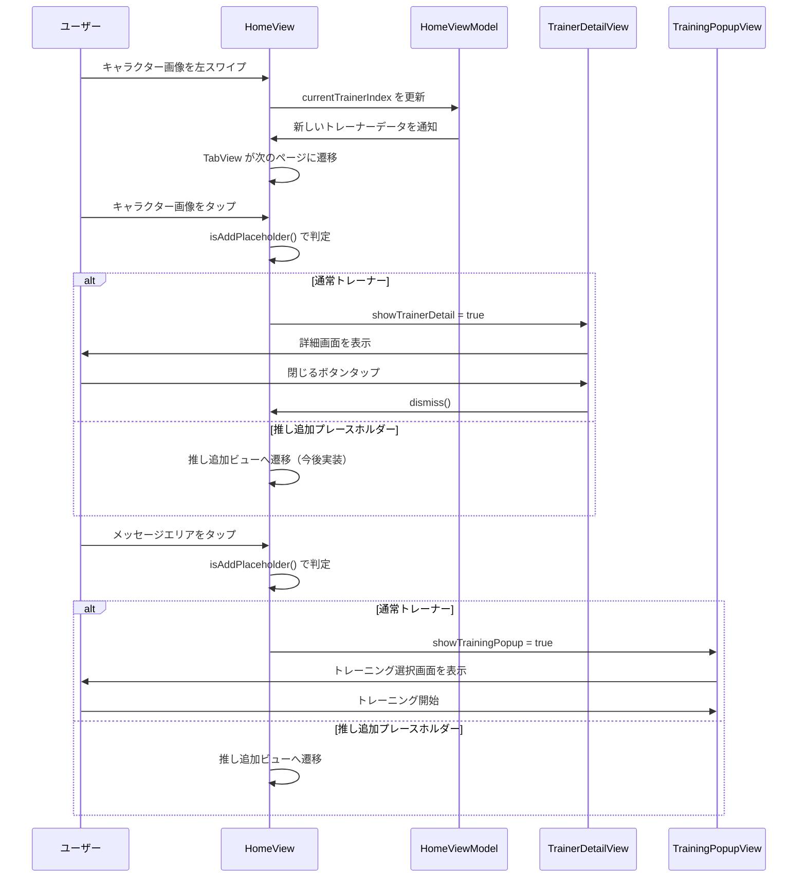

# 技術設計ドキュメント: ホーム画面UI改善

## Overview

この機能は、ホーム画面のUI/UXを改善し、推しトレーナーの詳細情報へのアクセスを容易にし、複数の推しトレーナー管理機能を提供する。

**目的**: ユーザーが推しトレーナーのプロフィール（名前、性格、一人称、二人称、ボイス情報など）を簡単に確認でき、スワイプ操作で複数の推しトレーナーを切り替えられるようにする。また、トレーニング開始への導線を明確化し、不要なナビゲーションボタンを削除してシンプルなUIを実現する。

**ユーザー**: Oshi-Trainerアプリのすべてのユーザーが、ホーム画面でこの機能を利用する。

**影響**: 現在のホーム画面の以下の点を変更する：
- キャラクター画像タップ時の挙動を「トレーニング選択画面表示」から「推しトレーナー詳細画面表示」に変更
- メッセージエリアをタップ可能にし、トレーニング選択画面への新しい導線を追加
- フッターの「統計」「推し」ボタンを削除
- スワイプジェスチャーによる推しトレーナー切り替え機能を追加
- 推し追加プレースホルダーの表示と導線を追加

### Goals

- ホーム画面から推しトレーナーの詳細情報（プロフィール、性格設定、ボイス情報）を確認できるようにする
- スワイプ操作で複数の推しトレーナー間をシームレスに切り替えられるようにする
- トレーニング開始への導線をメッセージエリアタップに変更し、操作を直感的にする
- 推し追加への導線を提供する（推し追加ビュー自体の実装は今後）
- ホーム画面のUIをシンプル化し、不要なボタンを削除する

### Non-Goals

- 推し追加ビューの実装（導線のみ提供、実際のビューは今後実装）
- 複数推しトレーナーのデータ永続化機能（現在はデフォルトトレーナーと推し追加プレースホルダーのみ）
- スワイプアニメーションの高度なカスタマイズ（SwiftUI標準のTabViewアニメーションを使用）

## Architecture

### 既存アーキテクチャ分析

現在のホーム画面は以下の構造を持つ：

- **MVVM パターン**: `HomeView` (View) + `HomeViewModel` (ViewModel) + `OshiTrainer` / `OshiTrainerTemplate` (Model)
- **データサービス層**: `DataServiceProtocol` を実装した `MockDataService` で推しトレーナーデータを提供
- **既存のモーダル表示**: `TrainingPopupView` を `.sheet()` で表示する実装パターンが存在
- **画像タップ処理**: `TransparentImageView` でアルファヒット判定付きのタップ処理を実装済み

### アーキテクチャ統合

**既存パターンの保持**:
- MVVM パターンを維持し、`HomeView` と `HomeViewModel` を拡張
- `.sheet()` モディファイアを使用したモーダル表示パターンを踏襲
- `DataServiceProtocol` を通じたデータアクセスパターンを継続

**新規コンポーネント**:
- `TrainerDetailView`: 推しトレーナー詳細画面（新規作成、モーダル表示）
- `HomeViewModel` 拡張: 推しトレーナーリスト管理、現在選択中インデックス管理、スワイプ切り替えロジック

**技術的整合性**:
- SwiftUI の `TabView` を使用してスワイプ切り替えを実装（既存のSwiftUIパターンと整合）
- ウマ娘風UIスタイル（`Color+Oshi`, `OshiButtonStyle`）を継承
- 既存のテーマカラーシステム（`viewModel.oshiTemplate.themeColor`）を活用

**ステアリング準拠**:
- Feature-Based Modularization: `Features/Home/` 配下に新規ビューを追加
- MVVM Pattern: ビジネスロジックは `HomeViewModel` に集約
- Protocol-Oriented Programming: データアクセスは `DataServiceProtocol` を継続使用

```mermaid
graph TB
    A[HomeView] -->|@StateObject| B[HomeViewModel]
    B -->|uses| C[DataServiceProtocol]
    C -->|implements| D[MockDataService]

    A -->|.sheet| E[TrainerDetailView - 新規]
    A -->|.sheet| F[TrainingPopupView - 既存]
    A -->|TabView| G[推しトレーナー切り替え - 新規]

    B -->|manages| H[OshiTrainer リスト]
    B -->|manages| I[現在選択中インデックス]

    E -->|表示| J[OshiTrainer データ]
    E -->|表示| K[OshiTrainerTemplate データ]
```

## 主要設計決定

### 決定1: スワイプ切り替えの実装方式

**決定**: SwiftUI の `TabView` を `.tabViewStyle(.page)` で使用し、推しトレーナー切り替えを実装する。

**コンテキスト**: 複数の推しトレーナーを水平スワイプで切り替える必要があり、スムーズなアニメーション、ページングインジケーター、双方向スワイプをサポートする必要がある。

**代替案**:
1. **カスタムGestureRecognizer**: `DragGesture()` でカスタム実装
2. **ScrollView + LazyHStack**: 横スクロールで実装
3. **TabView + PageTabViewStyle**: SwiftUI標準のページング機能を使用（選択）

**選択したアプローチ**: `TabView` + `.tabViewStyle(.page)` を使用

```swift
TabView(selection: $viewModel.currentTrainerIndex) {
    ForEach(Array(viewModel.trainers.enumerated()), id: \.element.id) { index, trainer in
        // キャラクター画像とUI
    }
    .tag(index)
}
.tabViewStyle(.page(indexDisplayMode: .never))
```

**根拠**:
- SwiftUI標準機能のため、保守性が高くバグが少ない
- スワイプアニメーションが自動で提供される
- `@Binding` による双方向データバインディングが容易
- 既存の SwiftUI パターンと整合性が高い

**トレードオフ**:
- **得られるもの**: 開発速度、保守性、標準的なスワイプUX、双方向バインディング
- **犠牲にするもの**: アニメーションの細かいカスタマイズ性（ただし、要件上は標準アニメーションで十分）

### 決定2: 推しトレーナーリストの管理方式

**決定**: `HomeViewModel` 内で推しトレーナーリストを `@Published var trainers: [OshiTrainer]` として管理し、デフォルトトレーナーと推し追加プレースホルダーを含める。

**コンテキスト**: デフォルト状態で「推乃 愛」と「推し追加プレースホルダー」の2つのアイテムをリストとして管理し、将来的に追加の推しトレーナーをサポートする必要がある。

**代替案**:
1. **単一トレーナー + フラグ管理**: `OshiTrainer?` + `showAddPlaceholder: Bool`
2. **配列管理**: `[OshiTrainer]` でリスト管理（選択）
3. **専用Enum**: `enum TrainerItem { case trainer(OshiTrainer), placeholder }`

**選択したアプローチ**: 配列 `[OshiTrainer]` でリスト管理し、推し追加プレースホルダーは特別な `id` を持つ `OshiTrainer` として扱う。

```swift
class HomeViewModel: ObservableObject {
    @Published var trainers: [OshiTrainer] = []
    @Published var currentTrainerIndex: Int = 0

    private let addPlaceholderId = UUID(uuidString: "00000000-0000-0000-0000-000000000001")!

    func isAddPlaceholder(_ trainer: OshiTrainer) -> Bool {
        trainer.id == addPlaceholderId
    }
}
```

**根拠**:
- 将来的な複数推しトレーナー対応が容易
- `TabView` + `ForEach` との親和性が高い
- データモデルの変更が最小限（既存の `OshiTrainer` を活用）
- 配列操作による柔軟な管理が可能

**トレードオフ**:
- **得られるもの**: 拡張性、コードのシンプルさ、既存モデルの再利用
- **犠牲にするもの**: 型安全性（推し追加プレースホルダーと通常のトレーナーが同じ型）→ `isAddPlaceholder()` で判定

### 決定3: トレーナー詳細画面のデータ渡し

**決定**: `TrainerDetailView` に `OshiTrainer` と `OshiTrainerTemplate` の両方を渡す。

**コンテキスト**: 詳細画面では、名前・レベル（`OshiTrainer`）と、性格・一人称・二人称・ボイス情報（`OshiTrainerTemplate`）の両方を表示する必要がある。

**代替案**:
1. **OshiTrainerのみ渡す + ViewModelでテンプレート取得**
2. **OshiTrainerTemplateのみ渡す**（名前とレベルが不足）
3. **両方渡す**（選択）

**選択したアプローチ**: `OshiTrainer` と `OshiTrainerTemplate` の両方を渡す

```swift
struct TrainerDetailView: View {
    let trainer: OshiTrainer
    let template: OshiTrainerTemplate
    @Environment(\.dismiss) private var dismiss

    var body: some View {
        // trainer.name, trainer.level
        // template.firstPerson, template.secondPerson, template.personalityDescription, template.characterVoice
    }
}
```

**根拠**:
- データ依存関係が明示的
- `TrainerDetailView` は表示のみでデータ取得ロジックを持たない（Single Responsibility）
- 既存の `OshiTrainer` と `OshiTrainerTemplate` モデルを活用

**トレードオフ**:
- **得られるもの**: シンプルな View、データフローの明確化、再利用性
- **犠牲にするもの**: 呼び出し側で2つのデータを渡す必要がある（ただし、`HomeViewModel` が両方を保持しているため問題なし）

## System Flows

### ユーザーインタラクションフロー



## Requirements Traceability

| 要件 | 要件概要 | コンポーネント | インターフェース | フロー |
|------|----------|----------------|------------------|--------|
| 1.1-1.9 | 推しトレーナー詳細画面の表示 | `TrainerDetailView`, `HomeView` | `.sheet(isPresented: $showTrainerDetail)` | ユーザーインタラクションフロー（詳細画面表示） |
| 2.1-2.3 | トレーニング開始の導線変更 | `HomeView`, メッセージエリアタップ処理 | `.onTapGesture` on dialogueBubble | ユーザーインタラクションフロー（メッセージタップ） |
| 3.1-3.2 | ナビゲーションボタン削除 | `HomeView`, footerView | footerView を削除 | - |
| 4.1-4.5 | スワイプによる推しトレーナー切り替え | `HomeView`, `TabView`, `HomeViewModel` | `TabView(selection: $viewModel.currentTrainerIndex)` | ユーザーインタラクションフロー（スワイプ切り替え） |
| 5.1-5.5 | 推し追加プレースホルダーの表示と導線 | `HomeView`, `HomeViewModel.isAddPlaceholder()` | 画像タップ/ボタンタップ時の分岐処理 | ユーザーインタラクションフロー（推し追加分岐） |

## Components and Interfaces

### Presentation Layer

#### TrainerDetailView（新規作成）

**責任と境界**
- **主要責任**: 推しトレーナーの詳細情報をモーダル形式で表示する
- **ドメイン境界**: プレゼンテーション層（UIのみ、ビジネスロジックなし）
- **データ所有**: なし（渡されたデータを表示のみ）
- **トランザクション境界**: 該当なし（読み取り専用）

**依存関係**
- **Inbound**: `HomeView` からモーダル表示される
- **Outbound**: なし（表示のみ）
- **External**: SwiftUI フレームワーク

**契約定義**

```swift
struct TrainerDetailView: View {
    // MARK: - Properties
    let trainer: OshiTrainer
    let template: OshiTrainerTemplate
    @Environment(\.dismiss) private var dismiss

    // MARK: - Body
    var body: some View {
        NavigationStack {
            ZStack {
                Color.oshiBackground.ignoresSafeArea()

                VStack(spacing: 24) {
                    // キャラクター画像（丸アイコン）
                    characterIconView

                    // 詳細情報
                    detailsView

                    Spacer()

                    // 閉じるボタン
                    closeButton
                }
                .padding()
            }
            .navigationBarTitleDisplayMode(.inline)
        }
    }

    // MARK: - Subviews
    private var characterIconView: some View {
        Image(template.characterImage)
            .resizable()
            .scaledToFill()
            .frame(width: 120, height: 120)
            .clipShape(Circle())
            .overlay(
                Circle()
                    .stroke(Color.oshiThemeColor(from: template.themeColor), lineWidth: 4)
            )
            .shadow(color: .black.opacity(0.15), radius: 8, x: 0, y: 4)
    }

    private var detailsView: some View {
        VStack(alignment: .leading, spacing: 16) {
            DetailRow(label: "名前", value: trainer.name)
            DetailRow(label: "イメージカラー", value: template.themeColor, color: Color.oshiThemeColor(from: template.themeColor))
            DetailRow(label: "一人称", value: template.firstPerson)
            DetailRow(label: "呼び方", value: template.secondPerson)
            DetailRow(label: "性格", value: template.personalityDescription)
            DetailRow(label: "ボイス", value: template.characterVoice)
        }
        .padding()
        .background(
            RoundedRectangle(cornerRadius: 16)
                .fill(Color.oshiBackgroundSecondary)
                .shadow(color: .black.opacity(0.05), radius: 8, x: 0, y: 2)
        )
    }

    private var closeButton: some View {
        Button("閉じる") {
            dismiss()
        }
        .buttonStyle(OshiButtonStyle())
        .padding(.bottom, 32)
    }
}

// MARK: - Detail Row Component
private struct DetailRow: View {
    let label: String
    let value: String
    var color: Color? = nil

    var body: some View {
        HStack {
            Text(label)
                .font(.system(size: 16, weight: .semibold, design: .rounded))
                .foregroundColor(.oshiTextSecondary)

            Spacer()

            if let color = color {
                HStack(spacing: 8) {
                    Circle()
                        .fill(color)
                        .frame(width: 20, height: 20)
                    Text(value)
                        .font(.system(size: 16, weight: .medium, design: .rounded))
                        .foregroundColor(.oshiTextPrimary)
                }
            } else {
                Text(value)
                    .font(.system(size: 16, weight: .medium, design: .rounded))
                    .foregroundColor(.oshiTextPrimary)
            }
        }
    }
}
```

**事前条件**:
- `trainer` と `template` が有効なデータを持っている

**事後条件**:
- ユーザーが詳細情報を閲覧できる
- 閉じるボタンまたは背景タップで画面を閉じられる

**不変条件**:
- 表示中にデータは変更されない（読み取り専用）

#### HomeView（既存修正）

**責任と境界**
- **主要責任**: ホーム画面のUI表示、ユーザーインタラクションのハンドリング、推しトレーナー切り替え
- **ドメイン境界**: プレゼンテーション層
- **データ所有**: UI状態（`showTrainerDetail`, `showTrainingPopup`）
- **トランザクション境界**: 該当なし

**依存関係**
- **Inbound**: アプリのメインエントリーポイント（`Oshi_TrainerApp.swift`）
- **Outbound**: `HomeViewModel`, `TrainerDetailView`, `TrainingPopupView`, `LevelDetailView`, `SettingsView`
- **External**: SwiftUI フレームワーク

**主要な変更点**

1. **footerView の削除**（統計・推しボタン削除）
2. **TabView によるスワイプ切り替え実装**
3. **キャラクター画像タップ処理の変更**（トレーニング選択 → 詳細画面 or 推し追加）
4. **メッセージエリアタップ処理の追加**（トレーニング選択画面へ or 推し追加）
5. **推し追加プレースホルダー対応**

**修正後の主要構造**

```swift
struct HomeView: View {
    @StateObject private var viewModel = HomeViewModel()
    @State private var showLevelDetail = false
    @State private var showTrainingPopup = false
    @State private var showTrainerDetail = false // 新規追加

    var body: some View {
        NavigationStack {
            ZStack(alignment: .bottom) {
                Color.oshiBackground.ignoresSafeArea()

                // 動的テーマカラーグラデーション背景
                themeGradientBackground

                VStack(spacing: 0) {
                    headerView
                    Spacer()
                }

                // TabView でスワイプ切り替え可能なキャラクター画像
                TabView(selection: $viewModel.currentTrainerIndex) {
                    ForEach(Array(viewModel.trainers.enumerated()), id: \.element.id) { index, trainer in
                        characterImageLayer(for: trainer)
                            .tag(index)
                    }
                }
                .tabViewStyle(.page(indexDisplayMode: .never))
                .frame(maxHeight: .infinity)

                // セリフ欄（タップ可能に変更）
                VStack(spacing: 0) {
                    Spacer()
                    dialogueBubble
                        .padding(.horizontal, 24)
                        .padding(.bottom, 32) // footerView 削除のため調整
                }
            }
            .sheet(isPresented: $showLevelDetail) {
                LevelDetailView(themeColor: viewModel.currentTemplate.themeColor)
            }
            .sheet(isPresented: $showTrainingPopup) {
                TrainingPopupView()
            }
            .sheet(isPresented: $showTrainerDetail) { // 新規追加
                TrainerDetailView(
                    trainer: viewModel.currentTrainer,
                    template: viewModel.currentTemplate
                )
            }
        }
    }

    // キャラクター画像レイヤー（タップ処理変更）
    private func characterImageLayer(for trainer: OshiTrainer) -> some View {
        GeometryReader { geometry in
            HStack {
                Spacer()
                if viewModel.isAddPlaceholder(trainer) {
                    // 推し追加プレースホルダー画像
                    Image("oshi_create") // /image/oshi_create.png をアセットに追加
                        .resizable()
                        .scaledToFit()
                        .frame(height: geometry.size.height * 0.7)
                        .onTapGesture {
                            // 推し追加ビューへ遷移（今後実装）
                            print("推し追加画面へ遷移")
                        }
                } else {
                    // 通常のトレーナー画像
                    TransparentImageView(
                        imageName: trainer.imageName,
                        onTap: {
                            showTrainerDetail = true // 詳細画面を表示
                        }
                    )
                    .frame(height: geometry.size.height * 0.7)
                    .scaleEffect(1.6)
                }
                Spacer()
            }
            .frame(width: geometry.size.width, height: geometry.size.height * 0.7)
            .position(x: geometry.size.width / 2, y: geometry.size.height - (geometry.size.height * 0.7 / 2))
        }
    }

    // メッセージエリア（タップ処理追加）
    private var dialogueBubble: some View {
        VStack(spacing: 4) {
            Text(viewModel.currentTrainer.name)
                .font(.system(size: 16, weight: .bold, design: .rounded))
                .foregroundColor(.oshiTextSecondary)

            if viewModel.isAddPlaceholder(viewModel.currentTrainer) {
                // 推し追加プレースホルダー用ボタン
                Button("キャラを作成する") {
                    // 推し追加ビューへ遷移（今後実装）
                    print("推し追加画面へ遷移")
                }
                .buttonStyle(OshiButtonStyle())
                .padding(.top, 8)
            } else {
                // 通常のメッセージ（タップでトレーニング選択へ）
                Text(viewModel.currentDialogue)
                    .font(.system(size: 18, weight: .medium, design: .rounded))
                    .foregroundColor(.oshiTextPrimary)
                    .onTapGesture {
                        showTrainingPopup = true
                        viewModel.updateDialogue(for: .trainingStart)
                    }
            }
        }
        .padding(.horizontal, 24)
        .padding(.vertical, 16)
        .frame(maxWidth: .infinity)
        .background(
            RoundedRectangle(cornerRadius: 20)
                .fill(Color.oshiBackgroundSecondary)
                .shadow(color: .black.opacity(0.15), radius: 12, x: 0, y: 4)
        )
        .multilineTextAlignment(.center)
    }

    // footerView は削除
}
```

**統合戦略**:
- **変更アプローチ**: 既存の `HomeView` を拡張（Extend）
- **後方互換性**: `LevelDetailView` と `SettingsView` へのナビゲーションは維持（ヘッダーボタンで引き続きアクセス可能）
- **移行パス**: footerView を削除し、TabView ベースのレイアウトに段階的に移行

#### HomeViewModel（既存拡張）

**責任と境界**
- **主要責任**: 推しトレーナーリストの管理、現在選択中のトレーナー管理、セリフ更新ロジック
- **ドメイン境界**: ビジネスロジック層
- **データ所有**: 推しトレーナーリスト、現在選択中インデックス、セリフ状態
- **トランザクション境界**: 該当なし（データ読み取りのみ、将来的に永続化を追加）

**依存関係**
- **Inbound**: `HomeView`
- **Outbound**: `DataServiceProtocol`, `DialogueTemplateProvider`
- **External**: Combine フレームワーク

**拡張内容**

```swift
class HomeViewModel: ObservableObject {
    // MARK: - Published Properties
    @Published var trainers: [OshiTrainer] = []
    @Published var templates: [OshiTrainerTemplate] = []
    @Published var currentTrainerIndex: Int = 0
    @Published var currentDialogue: String = ""

    // MARK: - Computed Properties
    var currentTrainer: OshiTrainer {
        trainers.indices.contains(currentTrainerIndex) ? trainers[currentTrainerIndex] : trainers[0]
    }

    var currentTemplate: OshiTrainerTemplate {
        templates.indices.contains(currentTrainerIndex) ? templates[currentTrainerIndex] : templates[0]
    }

    // MARK: - Private Properties
    private let dataService: DataServiceProtocol
    private let addPlaceholderId = UUID(uuidString: "00000000-0000-0000-0000-000000000001")!

    // MARK: - Initialization
    init(dataService: DataServiceProtocol = MockDataService.shared) {
        self.dataService = dataService
        loadTrainers()
    }

    // MARK: - Public Methods

    /// 推しトレーナーリストの読み込み
    func loadTrainers() {
        // デフォルトトレーナー「推乃 愛」
        let defaultTrainer = dataService.getOshiTrainer()
        let defaultTemplate = DefaultOshiTrainerData.oshiAiTemplate

        // 推し追加プレースホルダー
        let addPlaceholder = OshiTrainer(
            id: addPlaceholderId,
            name: "推し追加",
            level: 1,
            experience: 0,
            imageName: "oshi_create",
            currentDialogue: "新しい推しを作成しよう！"
        )
        let addPlaceholderTemplate = OshiTrainerTemplate(
            id: addPlaceholderId,
            name: "推し追加",
            themeColor: "pink",
            characterImage: "oshi_create",
            personalityType: .cheerful,
            firstPerson: "",
            secondPerson: "",
            personalityDescription: "",
            characterVoice: ""
        )

        trainers = [defaultTrainer, addPlaceholder]
        templates = [defaultTemplate, addPlaceholderTemplate]
        currentDialogue = DialogueTemplateProvider.getDialogue(for: .greeting)
    }

    /// 推し追加プレースホルダーかどうかを判定
    func isAddPlaceholder(_ trainer: OshiTrainer) -> Bool {
        trainer.id == addPlaceholderId
    }

    /// セリフの更新
    func updateDialogue(for category: DialogueTemplateProvider.DialogueCategory) {
        currentDialogue = DialogueTemplateProvider.getDialogue(for: category)
    }
}
```

**事前条件**:
- `DataServiceProtocol` が有効なトレーナーデータを返す

**事後条件**:
- `trainers` と `templates` にデフォルトトレーナーと推し追加プレースホルダーが含まれる
- `currentTrainerIndex` が有効な範囲内である

**不変条件**:
- `trainers.count == templates.count` が常に真
- `currentTrainerIndex` は `0..<trainers.count` の範囲内

## Data Models

### ドメインモデル

既存のデータモデルを活用し、最小限の変更で対応する。

**既存モデル（変更なし）**:
- `OshiTrainer`: 推しトレーナーの基本情報（名前、レベル、経験値、画像名、セリフ）
- `OshiTrainerTemplate`: 推しトレーナーのテンプレート情報（性格、一人称、二人称、ボイス情報など）
- `PersonalityType`: 性格タイプ（優しい、元気、クール、ツンデレ、厳しい）
- `EncouragementStyle`: 応援スタイル（熱血、冷静、自然、過保護）
- `FeedbackFrequency`: フィードバック頻度（最小限、適度、頻繁、常時）

**推し追加プレースホルダーの識別**:
- 特別な UUID（`00000000-0000-0000-0000-000000000001`）を持つ `OshiTrainer` インスタンスとして扱う
- `HomeViewModel.isAddPlaceholder()` メソッドで判定

**ビジネスルール**:
- 推しトレーナーリストは常に最低2つのアイテムを持つ（デフォルトトレーナー + 推し追加プレースホルダー）
- 推し追加プレースホルダーはリストの最後に配置される
- 推し追加プレースホルダーではトレーナー詳細画面を表示せず、推し追加ビューに遷移する

## Error Handling

### エラー戦略

この機能は主にUI操作であり、データ永続化や外部API通信を伴わないため、エラーハンドリングは最小限。

### エラーカテゴリと対応

**ユーザーエラー（4xx相当）**:
- **不正なスワイプ操作**: TabView が自動で範囲内に制限するため、エラーなし
- **無効なインデックス**: `currentTrainer` と `currentTemplate` の計算プロパティでフォールバック（`trainers[0]`）

**システムエラー（5xx相当）**:
- **画像アセットの欠損**: SwiftUI が空のイメージを表示（クラッシュしない）
- **DataService の失敗**: `MockDataService` は常に成功するため、現時点では対応不要（将来的に永続化を追加した際に実装）

**ビジネスロジックエラー（422相当）**:
- **空のトレーナーリスト**: `loadTrainers()` で必ずデフォルトトレーナーとプレースホルダーを追加するため、発生しない

### モニタリング

- **ログ記録**: 推し追加ビューへの遷移時に `print()` でログ出力（開発時のみ、本番では削除またはログシステムに統合）
- **状態追跡**: `currentTrainerIndex` の変更を `@Published` でリアクティブに追跡

## Testing Strategy

### ユニットテスト

**HomeViewModelTests.swift**:
1. **testLoadTrainers**: `loadTrainers()` でデフォルトトレーナーとプレースホルダーが正しく読み込まれることを確認
2. **testIsAddPlaceholder**: `isAddPlaceholder()` が正しく判定することを確認
3. **testCurrentTrainer**: `currentTrainerIndex` に応じて `currentTrainer` が正しく返されることを確認
4. **testCurrentTemplate**: `currentTrainerIndex` に応じて `currentTemplate` が正しく返されることを確認
5. **testUpdateDialogue**: セリフ更新ロジックが正しく動作することを確認

### 統合テスト

**HomeViewIntegrationTests.swift**:
1. **testSwipeNavigation**: TabView で左右スワイプした際に正しいトレーナーに切り替わることを確認
2. **testTrainerDetailPresentation**: キャラクター画像タップ時に詳細画面が表示されることを確認
3. **testTrainingPopupPresentation**: メッセージタップ時にトレーニング選択画面が表示されることを確認
4. **testAddPlaceholderTap**: 推し追加プレースホルダータップ時に適切な動作（現時点ではログ出力）が行われることを確認
5. **testFooterRemoval**: footerView が削除され、統計・推しボタンが表示されないことを確認

### UIテスト

**HomeViewUITests.swift**:
1. **testHomeScreenRendering**: ホーム画面が正しくレンダリングされることを確認（ヘッダー、キャラクター画像、メッセージエリア）
2. **testSwipeGesture**: 実機/シミュレータでスワイプジェスチャーが正しく機能することを確認
3. **testDetailScreenInteraction**: 詳細画面の表示、内容確認、閉じる操作が正しく動作することを確認
4. **testAddPlaceholderVisual**: 推し追加プレースホルダーが正しく表示されることを確認

## Security Considerations

**この機能におけるセキュリティリスクは最小限**:

- **データの取り扱い**: ローカルデータのみ（現時点で外部通信なし）
- **入力検証**: ユーザー入力はタップ操作のみで、SQL インジェクションや XSS のリスクなし
- **認証/認可**: 該当なし（すべてのユーザーがアクセス可能）

**将来的な考慮事項**（推しトレーナーデータの永続化時）:
- データの暗号化（Core Data の暗号化オプション）
- バックアップとリストア時のデータ整合性検証

## アセット管理

### 必要なアセット

1. **推し追加プレースホルダー画像**: `/image/oshi_create.png`
   - Xcode プロジェクトの `Assets.xcassets` に `oshi_create` として追加
   - 解像度: 1x, 2x, 3x を提供（既存画像が PNG 形式のため、そのまま使用可能）

### アセット追加手順

1. `/image/oshi_create.png` を Xcode の `Assets.xcassets` にドラッグ&ドロップ
2. アセット名を `oshi_create` に設定
3. 必要に応じて 2x, 3x バージョンを追加（現在は 1x のみで開始可能）
