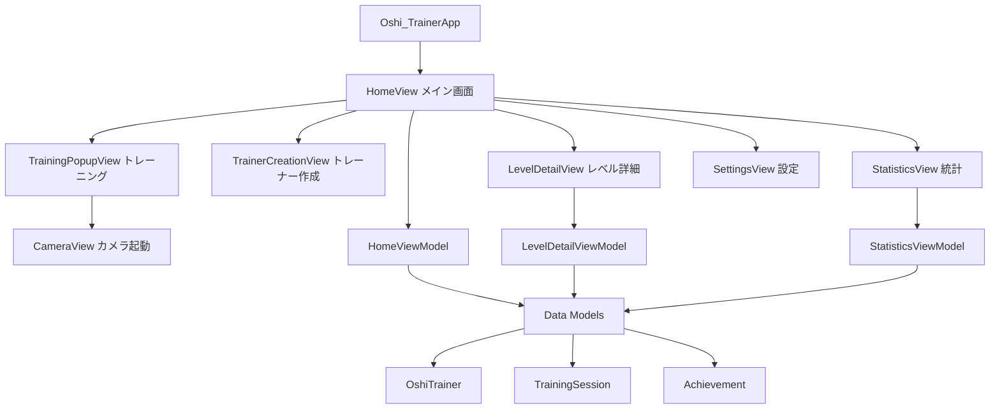
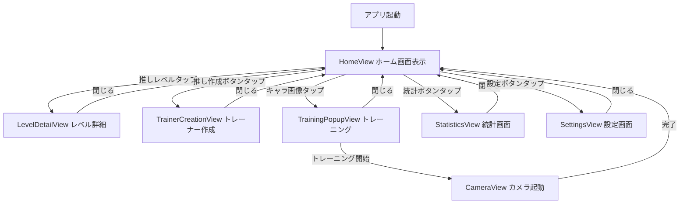
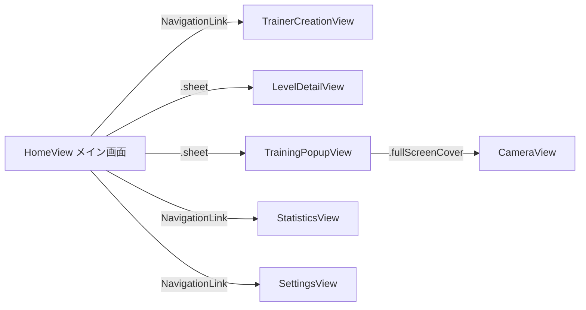
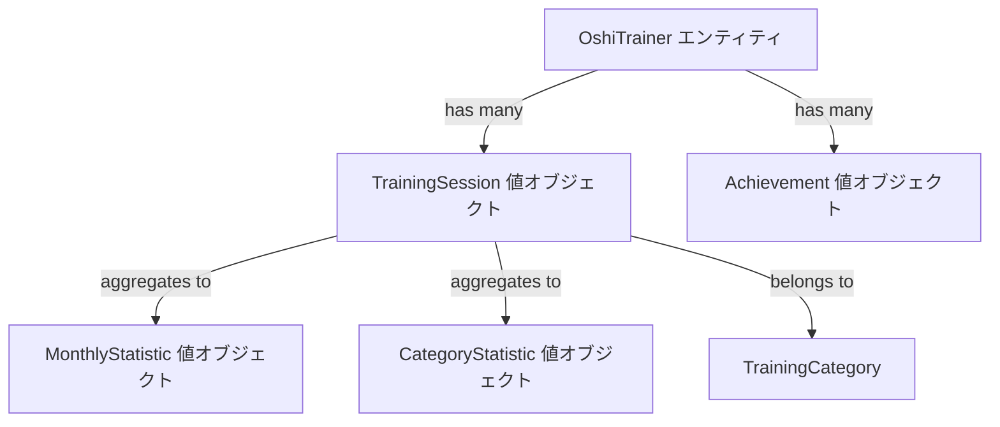

# 技術設計書

## 概要

本フィーチャーは、Oshi-TrainerアプリケーションのフロントエンドUIを実装します。ウマ娘のホーム画面をイメージしたインタラクティブなユーザーインターフェースを提供し、推しトレーナーとの体験を通じてトレーニングのモチベーションを向上させることを目的としています。

**目的**: ユーザーに推しトレーナーとのインタラクティブな体験を提供し、トレーニングへのモチベーションを向上させる視覚的に魅力的なUIを構築する。

**ユーザー**: トレーニングアプリを利用するユーザー（ゲーム・アニメファンが主要ターゲット）が、推しレベル確認、トレーナー作成、トレーニング開始、統計閲覧、設定変更といった機能を利用する。

**影響**: 現在の基本的なSwiftUIテンプレート（ContentView）を、複数の画面とインタラクティブなナビゲーションを持つ完全な機能的UIに変換する。

### ゴール

- ウマ娘風のホーム画面UIを実装し、推しトレーナーとのインタラクティブな体験を提供する
- SwiftUIとMVVMアーキテクチャを活用した、保守性と拡張性の高いコード構造を構築する
- 全ての要件（7つの主要要件）を満たす画面遷移とインタラクションフローを実装する
- モックデータを使用したUIのみの実装（バックエンドやデータ永続化は対象外）

### 非ゴール

- バックエンドシステムの実装（API、サーバー、データベース）
- データ永続化機能（Core Data、UserDefaults等）
- 実際のカメラを使用したトレーニング機能の実装（カメラ起動UIのみ）
- LLMを使用した推しトレーナーのパーソナリティ生成
- 実際の統計計算ロジック（モックデータ表示のみ）

## アーキテクチャ

### 既存アーキテクチャの分析

現在のプロジェクトは基本的なXcodeテンプレートから生成されており、以下の構造を持つ：

- **エントリーポイント**: `Oshi_TrainerApp.swift` - SwiftUIアプリのメインエントリーポイント
- **初期ビュー**: `ContentView.swift` - プレースホルダーのシンプルなビュー
- **アーキテクチャパターン**: 未定義（テンプレートのみ）

本設計では、既存の構造を拡張し、以下のアーキテクチャパターンを導入する：

- **MVVMパターンの導入**: Views、ViewModels、Modelsの明確な分離
- **SwiftUI宣言的UIの活用**: `@State`、`@StateObject`、`@EnvironmentObject`による状態管理
- **Feature-Based構造**: 機能ごとにディレクトリを分割（Steering: structure.mdに準拠）

### ハイレベルアーキテクチャ



### アーキテクチャ統合

**保持される既存パターン**:
- SwiftUIベースのUI構築
- Xcodeプロジェクト構造とターゲット設定
- iOS 15.0+のデプロイメントターゲット

**新規コンポーネントの根拠**:
- **MVVMパターン**: ビジネスロジックとUIの分離により、テスタビリティと保守性を向上
- **Feature-Based構造**: 機能ごとのモジュール化により、将来の拡張性を確保
- **モックデータレイヤー**: バックエンド実装前にUI開発を完結させるため

**技術スタックの整合性**:
- SwiftUI（Steering: tech.md準拠）
- MVVM（Steering: structure.md推奨パターン）
- iOS 15.0+（既存プロジェクト設定）

**ステアリング準拠**:
- `structure.md`: Feature-Basedディレクトリ構造に従う
- `tech.md`: SwiftUI、Combine、Protocol-Oriented Programmingを活用
- `product.md`: 推しトレーナーとのインタラクティブ体験を重視

### 技術整合性

本フィーチャーは既存のiOSアプリケーション構造を拡張する形で実装されます：

**開発環境**:
- **Xcode**: 26.0（最新バージョン）
- **iOS**: 26（最新バージョン）
- **最小デプロイメントターゲット**: iOS 26

**既存技術スタックとの整合性**:
- **言語**: Swift 6.x
- **UIフレームワーク**: SwiftUI
- **状態管理**: Combine（`@StateObject`、`@ObservedObject`、`@EnvironmentObject`）
- **ナビゲーション**: NavigationStack（iOS 16+で導入、iOS 26で完全サポート）

**新規導入する依存関係**:
- なし（標準のSwiftUIとCombineのみを使用）

**既存パターンからの逸脱**:
- なし（プロジェクトが初期段階のため、新規パターンを確立する）

### ウマ娘風UIデザインリファレンス

本設計は、ウマ娘プリティーダービーのUIデザインを参考にします。

**レイアウト原則**:
- **中央配置キャラクター**: 3Dキャラクターを画面中央に配置し、全身を表示
- **ボトムUI**: 重要なUI要素を画面下部に配置（片手操作を考慮）
- **ヘッダー情報**: レベル、経験値などの重要な情報を上部に配置
- **曲線的なデザイン**: アイコン配置やボタンに曲線を使用し、遊び心と柔らかさを表現

**配色戦略**:
- **ベースカラー（70%）**: 白と青みがかったグレー（明るく清潔な印象）
- **メインカラー（25%）**: 緑色（競馬場の芝生を連想）
- **アクセントカラー（5%）**: オレンジまたはピンク（活気と魅力）
- **明るいグラデーション**: 緑色の要素に明るいグラデーションを適用

**タイポグラフィ**:
- **フォントスタイル**: ゴシック体（安定感と均一な太さ、遊び心のあるデザイン）
- **フォントサイズ**:
  - 数値表示: 26-28px
  - メインボタン: 32-42px
  - 読みやすく大きなフォントサイズを使用

**インタラクション設計**:
- **キャラクター相互作用**: 背景のキャラクターをタップして会話表示
- **片手操作**: 重要なUI要素を親指の届く範囲に配置
- **直感的なナビゲーション**: ユーザーが迷わず選択できる情報提示

**画面構成ルール**:
- **ヘッダー**: ゲーム全体の状態（レベル、経験値、目標）
- **サブ情報**: キャラクタービジュアル、セリフ
- **メイン情報**: コアゲームプレイコマンド、パラメータ
- **フッター**: ナビゲーション、ログ、メニュー

### 主要設計決定

#### 決定1: SwiftUI NavigationStackの採用

**コンテキスト**: 複数の画面間でのナビゲーション実装が必要。iOS 26（最新バージョン）を使用し、最新のSwiftUI機能を活用する。

**代替案**:
1. **NavigationView（iOS 13+）**: 非推奨であり、最新のiOSでは使用すべきでない
2. **UINavigationController + UIHostingController**: SwiftUIとUIKitの混在により複雑性が増加
3. **カスタムナビゲーションシステム**: 実装コストが高く、標準UIから逸脱

**選択したアプローチ**: NavigationStack（iOS 16+で導入）を使用。iOS 26で完全にサポートされ、最新の機能を活用。

**根拠**:
- SwiftUIネイティブのナビゲーションにより、宣言的UIのメリットを最大化
- iOS 26の最新機能を活用し、パフォーマンスとユーザー体験を最適化
- 型安全なナビゲーションとプログラマティックなナビゲーション制御が可能

**トレードオフ**:
- **獲得**: 最新のSwiftUI機能、宣言的で保守しやすいコード、型安全なナビゲーション
- **犠牲**: iOS 26未満のデバイスはサポート外（本プロジェクトの要件に合致）

#### 決定2: モックデータによるUI実装

**コンテキスト**: バックエンドシステムが未実装の状態で、フロントエンドUIを完成させる必要がある。

**代替案**:
1. **実際のデータ永続化（Core Data、UserDefaults）**: バックエンド実装を待たずにローカルデータを保存
2. **空のUI実装**: データ表示なしで構造のみ実装
3. **ハードコードされたモックデータ**: 静的データをコード内に直接記述

**選択したアプローチ**: プロトコルベースのモックデータサービスを実装し、将来的な実データサービスへの置き換えを容易にする。

**根拠**:
- プロトコル指向により、実データサービス実装時の置き換えが容易
- UIの動作検証とユーザーフィードバックを早期に取得可能
- データ層とUI層の明確な分離により、保守性を向上

**トレードオフ**:
- **獲得**: 早期のUI検証、将来の拡張性、テスタビリティ
- **犠牲**: モックデータサービスの実装工数

#### 決定3: MVVM + ObservableObjectパターンの採用

**コンテキスト**: 複数の画面で状態を管理し、UIとビジネスロジックを分離する必要がある。

**代替案**:
1. **@Stateのみによる状態管理**: シンプルだが、複雑な状態管理に不向き
2. **Redux-like状態管理**: 一元的な状態管理だが、学習コストと実装コストが高い
3. **MVCパターン**: UIKitの伝統的なパターンだが、SwiftUIには不適合

**選択したアプローチ**: MVVMパターンと`ObservableObject`プロトコルを組み合わせて、画面ごとにViewModelを作成。

**根拠**:
- SwiftUIとCombineのネイティブな統合により、リアクティブな状態管理を実現
- ビジネスロジックとUIの明確な分離により、テストが容易
- SwiftUIのベストプラクティスに準拠

**トレードオフ**:
- **獲得**: テスタビリティ、保守性、SwiftUIとの相性の良さ
- **犠牲**: 小規模な機能でもViewModel作成が必要になる場合がある

## システムフロー

### ユーザーインタラクションフロー



### 画面遷移とナビゲーション



## 要件トレーサビリティ

| 要件 | 要件概要 | コンポーネント | インターフェース | フロー |
|------|---------|--------------|--------------|--------|
| 1.1-1.8 | メイン画面の表示 | HomeView, HomeViewModel | `HomeView.body` | ユーザーインタラクションフロー |
| 2.1-2.5 | 推しレベル詳細 | LevelDetailView, LevelDetailViewModel | `.sheet(isPresented:)` | レベルタップ→詳細表示→閉じる |
| 3.1-3.3 | トレーナー作成画面 | TrainerCreationView | `NavigationLink` | 作成ボタン→作成画面→閉じる |
| 4.1-4.6 | トレーニング開始 | TrainingPopupView, CameraView | `.sheet`, `.fullScreenCover` | キャラタップ→ポップアップ→カメラ起動 |
| 5.1-5.5 | 統計画面 | StatisticsView, StatisticsViewModel | `NavigationLink` | 統計ボタン→統計画面→閉じる |
| 6.1-6.5 | 設定画面 | SettingsView | `NavigationLink` | 設定ボタン→設定画面→閉じる |
| 7.1-7.5 | UI/UXの一貫性 | 全コンポーネント | SwiftUI標準、カスタムスタイル | 全フロー |

## コンポーネントとインターフェース

### ビュー層（Views）

#### HomeView（メイン画面）

**責任と境界**
- **主要責任**: アプリのメイン画面として、推しトレーナーとのインタラクションのハブを提供する
- **ドメイン境界**: UI層 - ホーム画面の表示とナビゲーションの起点
- **データ所有権**: 画面表示状態（モーダルやナビゲーションの状態）
- **トランザクション境界**: なし（UIのみ）

**依存関係**
- **インバウンド**: `Oshi_TrainerApp`がルートビューとして表示
- **アウトバウンド**: `HomeViewModel`（状態管理）、子ビュー（LevelDetailView、TrainerCreationView等）
- **外部**: なし

**契約定義**

**UIコンポーネント構造（ウマ娘風レイアウト）**:
- **ヘッダー（上部）**:
  - 左上: 推しレベル表示（タップ可能、26-28pxフォント）
  - 右上: 推し作成ボタン（アイコンまたはテキストボタン）
- **中央エリア**:
  - 推しトレーナーキャラ画像（全身表示、タップ可能）
  - セリフ欄（キャラクターの前面、吹き出しスタイル）
- **フッター（下部）**:
  - 統計ボタン（左下、曲線的な配置）
  - 設定ボタン（右下、曲線的な配置）
  - その他ナビゲーションボタン

**デザイン要素**:
- 背景: 白と青みがかったグレー（ベースカラー70%）
- アクセントカラー: 緑色のグラデーション（メインカラー25%）、オレンジ/ピンク（アクセント5%）
- ボタン: 大きく読みやすいフォント（32-42px）、曲線的なデザイン
- キャラクターとの相互作用を強調

**状態管理**:
```swift
@StateObject var viewModel: HomeViewModel
@State var showLevelDetail: Bool = false
@State var showTrainingPopup: Bool = false
```

**インタラクション**:
- 推しレベルタップ → `showLevelDetail = true` → LevelDetailViewを`.sheet`で表示
- 推し作成ボタンタップ → NavigationLinkでTrainerCreationViewに遷移
- キャラ画像タップ → `showTrainingPopup = true` → TrainingPopupViewを`.sheet`で表示
- 統計ボタンタップ → NavigationLinkでStatisticsViewに遷移
- 設定ボタンタップ → NavigationLinkでSettingsViewに遷移

#### LevelDetailView（レベル詳細画面）

**責任と境界**
- **主要責任**: 推しレベル、経験値、称号を表示する
- **ドメイン境界**: UI層 - レベル情報の詳細表示
- **データ所有権**: なし（ViewModelから取得）
- **トランザクション境界**: なし（UIのみ）

**依存関係**
- **インバウンド**: HomeViewから`.sheet`で表示
- **アウトバウンド**: `LevelDetailViewModel`
- **外部**: なし

**契約定義**

**UIコンポーネント構造**:
- 現在の推しレベル表示
- 獲得経験値の総量表示
- 称号リスト（`List`または`ScrollView`）

**状態管理**:
```swift
@StateObject var viewModel: LevelDetailViewModel
@Environment(\.dismiss) var dismiss
```

#### TrainerCreationView（トレーナー作成画面）

**責任と境界**
- **主要責任**: 推しトレーナーのカスタマイズUIを提供する（モックUI）
- **ドメイン境界**: UI層 - トレーナー作成とカスタマイズ
- **データ所有権**: フォーム入力状態（名前、外見等）
- **トランザクション境界**: なし（UIのみ、データ保存は非ゴール）

**依存関係**
- **インバウンド**: HomeViewからNavigationLinkで遷移
- **アウトバウンド**: なし（モックUI）
- **外部**: なし

**契約定義**

**UIコンポーネント構造**:
- トレーナー名入力フィールド
- カスタマイズオプション（プレースホルダー）
- 保存ボタン（モック、実際の保存は行わない）

#### TrainingPopupView（トレーニングポップアップ）

**責任と境界**
- **主要責任**: トレーニング種目の説明と開始ボタンを提供
- **ドメイン境界**: UI層 - トレーニング開始フロー
- **データ所有権**: カメラ起動状態
- **トランザクション境界**: なし（UIのみ）

**依存関係**
- **インバウンド**: HomeViewから`.sheet`で表示
- **アウトバウンド**: `CameraView`
- **外部**: なし

**契約定義**

**UIコンポーネント構造**:
- トレーニング種目名と説明
- 推奨時間の表示
- トレーニング開始ボタン
- 閉じるボタン

**状態管理**:
```swift
@State var showCamera: Bool = false
@Environment(\.dismiss) var dismiss
```

**インタラクション**:
- トレーニング開始ボタンタップ → `showCamera = true` → CameraViewを`.fullScreenCover`で表示

#### CameraView（カメラ起動画面）

**責任と境界**
- **主要責任**: カメラ起動UIを表示する（実際のカメラ機能は非ゴール）
- **ドメイン境界**: UI層 - カメラUIの表示
- **データ所有権**: なし
- **トランザクション境界**: なし（UIのみ）

**依存関係**
- **インバウンド**: TrainingPopupViewから`.fullScreenCover`で表示
- **アウトバウンド**: なし
- **外部**: なし（実際のカメラAPIは使用しない）

**契約定義**

**UIコンポーネント構造**:
- プレースホルダーテキスト「カメラが起動されます」
- 閉じるボタン

**状態管理**:
```swift
@Environment(\.dismiss) var dismiss
```

#### StatisticsView（統計画面）

**責任と境界**
- **主要責任**: 月別・種目別のトレーニング統計を表示
- **ドメイン境界**: UI層 - 統計データの可視化
- **データ所有権**: なし（ViewModelから取得）
- **トランザクション境界**: なし（UIのみ）

**依存関係**
- **インバウンド**: HomeViewからNavigationLinkで遷移
- **アウトバウンド**: `StatisticsViewModel`
- **外部**: なし

**契約定義**

**UIコンポーネント構造**:
- 月別統計セクション（チャートまたはリスト）
- 種目別統計セクション（チャートまたはリスト）
- フィルタリングオプション（オプション）

**状態管理**:
```swift
@StateObject var viewModel: StatisticsViewModel
```

#### SettingsView（設定画面）

**責任と境界**
- **主要責任**: アプリ設定とクレジット情報を表示
- **ドメイン境界**: UI層 - 設定画面
- **データ所有権**: なし
- **トランザクション境界**: なし（UIのみ）

**依存関係**
- **インバウンド**: HomeViewからNavigationLinkで遷移
- **アウトバウンド**: なし
- **外部**: なし

**契約定義**

**UIコンポーネント構造**:
- アプリ設定項目（プレースホルダー）
- クレジット情報
- バージョン情報

### ビューモデル層（ViewModels）

#### HomeViewModel

**責任と境界**
- **主要責任**: ホーム画面の状態とビジネスロジックを管理
- **ドメイン境界**: ビューモデル層 - ホーム画面のロジック
- **データ所有権**: 推しトレーナー情報、セリフ、現在の状態
- **トランザクション境界**: なし（モックデータ）

**依存関係**
- **インバウンド**: HomeViewから参照
- **アウトバウンド**: `MockDataService`（将来的には実データサービス）
- **外部**: なし

**契約定義**

**サービスインターフェース**:
```swift
class HomeViewModel: ObservableObject {
    @Published var oshiTrainer: OshiTrainer
    @Published var currentDialogue: String
    @Published var oshiLevel: Int

    func loadTrainerData()
    func updateDialogue()
}
```

**事前条件**: なし
**事後条件**: `oshiTrainer`、`currentDialogue`、`oshiLevel`が初期化される
**不変条件**: `oshiLevel >= 1`

#### LevelDetailViewModel

**責任と境界**
- **主要責任**: レベル詳細画面のデータを管理
- **ドメイン境界**: ビューモデル層 - レベル情報の取得と表示
- **データ所有権**: 経験値、称号リスト
- **トランザクション境界**: なし（モックデータ）

**依存関係**
- **インバウンド**: LevelDetailViewから参照
- **アウトバウンド**: `MockDataService`
- **外部**: なし

**契約定義**

**サービスインターフェース**:
```swift
class LevelDetailViewModel: ObservableObject {
    @Published var currentLevel: Int
    @Published var totalExperience: Int
    @Published var achievements: [Achievement]

    func loadLevelData()
}
```

**事前条件**: なし
**事後条件**: `currentLevel`、`totalExperience`、`achievements`が初期化される
**不変条件**: `currentLevel >= 1`、`totalExperience >= 0`

#### StatisticsViewModel

**責任と境界**
- **主要責任**: 統計画面のデータを管理
- **ドメイン境界**: ビューモデル層 - 統計データの取得と処理
- **データ所有権**: 月別統計、種目別統計
- **トランザクション境界**: なし（モックデータ）

**依存関係**
- **インバウンド**: StatisticsViewから参照
- **アウトバウンド**: `MockDataService`
- **外部**: なし

**契約定義**

**サービスインターフェース**:
```swift
class StatisticsViewModel: ObservableObject {
    @Published var monthlyStats: [MonthlyStatistic]
    @Published var categoryStats: [CategoryStatistic]

    func loadStatistics()
    func filterByMonth(month: Int)
    func filterByCategory(category: String)
}
```

**事前条件**: なし
**事後条件**: `monthlyStats`、`categoryStats`が初期化される

### サービス層（Services）

#### MockDataService

**責任と境界**
- **主要責任**: モックデータを提供し、将来的な実データサービスへの移行を容易にする
- **ドメイン境界**: サービス層 - データ提供
- **データ所有権**: モックデータの生成と管理
- **トランザクション境界**: なし

**依存関係**
- **インバウンド**: 各ViewModel
- **アウトバウンド**: なし
- **外部**: なし

**契約定義**

**サービスインターフェース**:
```swift
protocol DataServiceProtocol {
    func getOshiTrainer() -> OshiTrainer
    func getLevelData() -> (level: Int, experience: Int, achievements: [Achievement])
    func getStatistics() -> (monthly: [MonthlyStatistic], category: [CategoryStatistic])
}

class MockDataService: DataServiceProtocol {
    func getOshiTrainer() -> OshiTrainer
    func getLevelData() -> (level: Int, experience: Int, achievements: [Achievement])
    func getStatistics() -> (monthly: [MonthlyStatistic], category: [CategoryStatistic])
}
```

**事前条件**: なし
**事後条件**: 有効なモックデータが返される
**不変条件**: 返されるデータは常に一貫性がある

## データモデル

### ドメインモデル

本UIフィーチャーでは、以下のドメインモデルを定義します。これらはビジネスロジックを持たないデータ構造であり、将来的なバックエンド実装時に拡張されることを想定しています。

**コアコンセプト**:
- **OshiTrainer**: 推しトレーナーのエンティティ（ユーザーごとに1つ）
- **TrainingSession**: トレーニングセッションの記録（値オブジェクト）
- **Achievement**: 獲得した称号（値オブジェクト）
- **MonthlyStatistic**: 月別統計データ（値オブジェクト）
- **CategoryStatistic**: 種目別統計データ（値オブジェクト）

**ビジネスルールと不変条件**:
- `OshiTrainer.level`は1以上
- `OshiTrainer.experience`は0以上
- `Achievement.isUnlocked`はtrueの場合のみ表示される
- 統計データは過去のデータのみを含む

### 論理データモデル

```swift
// 推しトレーナーエンティティ
struct OshiTrainer: Identifiable {
    let id: UUID
    var name: String
    var level: Int // >= 1
    var experience: Int // >= 0
    var imageName: String // アセット名
    var currentDialogue: String
}

// トレーニングセッション
struct TrainingSession: Identifiable {
    let id: UUID
    let date: Date
    let category: TrainingCategory
    let durationMinutes: Int
    let completionStatus: CompletionStatus
}

enum TrainingCategory: String, CaseIterable {
    case pushup = "腕立て伏せ"
    case squat = "スクワット"
    case plank = "プランク"
    case running = "ランニング"
}

enum CompletionStatus {
    case completed
    case inProgress
    case cancelled
}

// 称号
struct Achievement: Identifiable {
    let id: UUID
    let title: String
    let description: String
    let iconName: String
    let isUnlocked: Bool
    let unlockedDate: Date?
}

// 月別統計
struct MonthlyStatistic: Identifiable {
    let id: UUID
    let month: Date
    let totalSessions: Int
    let totalDurationMinutes: Int
    let experienceGained: Int
}

// 種目別統計
struct CategoryStatistic: Identifiable {
    let id: UUID
    let category: TrainingCategory
    let totalSessions: Int
    let totalDurationMinutes: Int
    let averageDuration: Double
}
```

### ドメインモデル図



### データ契約と統合

**APIデータ転送**:
将来的な実装時に以下のJSON構造を想定：

```json
// OshiTrainer
{
  "id": "uuid",
  "name": "string",
  "level": "integer",
  "experience": "integer",
  "imageName": "string",
  "currentDialogue": "string"
}

// TrainingSession
{
  "id": "uuid",
  "date": "ISO8601 string",
  "category": "string",
  "durationMinutes": "integer",
  "completionStatus": "string"
}

// Achievement
{
  "id": "uuid",
  "title": "string",
  "description": "string",
  "iconName": "string",
  "isUnlocked": "boolean",
  "unlockedDate": "ISO8601 string or null"
}
```

**イベントスキーマ**: なし（現段階ではイベント駆動アーキテクチャは使用しない）

**サービス間データ管理**: なし（UIのみの実装のため）

## エラーハンドリング

### エラー戦略

本UIフィーチャーでは、モックデータを使用するため、実際のエラーは発生しません。しかし、将来的な実装を考慮し、以下のエラーハンドリング戦略を定義します。

### エラーカテゴリと対応

**ユーザーエラー（4xx相当）**:
- **無効な入力**: トレーナー名が空白 → フィールドレベルのバリデーションと警告表示
- **認証エラー**: （将来的な実装）未認証ユーザー → ログイン画面への誘導

**システムエラー（5xx相当）**:
- **データ読み込み失敗**: モックデータサービスのエラー → エラーメッセージとリトライボタンの表示
- **ネットワークタイムアウト**: （将来的な実装）API通信の失敗 → オフラインモードとリトライ機能

**ビジネスロジックエラー（422相当）**:
- **レベル条件未達**: 特定機能へのアクセス制限 → 条件説明と次のアクションの提示

### モニタリング

**現段階のモニタリング**:
- エラーログ: `print()`による簡易ログ出力
- ヘルスモニタリング: なし

**将来的な実装**:
- エラートラッキング: Crashlytics、Sentryなどの導入
- ロギング: OSLogやSwiftyBeaverなどのロギングライブラリ
- ヘルスモニタリング: API応答時間、エラー率の計測

## テスト戦略

### ユニットテスト

**ViewModelのテスト**:
1. `HomeViewModel`のデータ読み込みテスト（モックデータが正しく取得されるか）
2. `LevelDetailViewModel`のレベル計算ロジックテスト（将来的な実装）
3. `StatisticsViewModel`の統計データフィルタリングテスト
4. `MockDataService`のデータ提供テスト

**Modelのテスト**:
1. `OshiTrainer`の不変条件テスト（level >= 1、experience >= 0）
2. `TrainingCategory`のケーステスト
3. `Achievement`のアンロック状態テスト

### 統合テスト

**画面遷移のテスト**:
1. ホーム画面から各画面への遷移テスト（NavigationLink、.sheet、.fullScreenCover）
2. モーダル表示と閉じる操作のテスト
3. 複数の画面遷移を組み合わせたフローテスト

**データフローのテスト**:
1. ViewModelからViewへのデータバインディングテスト
2. ユーザーインタラクションによる状態変更テスト

### UIテスト

**クリティカルユーザーパス**:
1. アプリ起動からホーム画面表示までのフロー
2. 推しレベルタップ→詳細表示→閉じる→ホーム画面に戻るフロー
3. キャラ画像タップ→トレーニングポップアップ→カメラ起動→閉じる→ホーム画面に戻るフロー
4. 統計画面への遷移と統計データ表示のフロー
5. 設定画面への遷移とクレジット情報表示のフロー

**アクセシビリティテスト**:
1. VoiceOverによる画面読み上げテスト
2. Dynamic Typeによるテキストサイズ変更テスト

### パフォーマンステスト

**現段階では不要**（モックデータのみのため）

**将来的な実装時**:
1. 大量の統計データ表示時のレンダリングパフォーマンス
2. スムーズなアニメーション（60fps維持）のテスト
3. メモリ使用量のモニタリング
