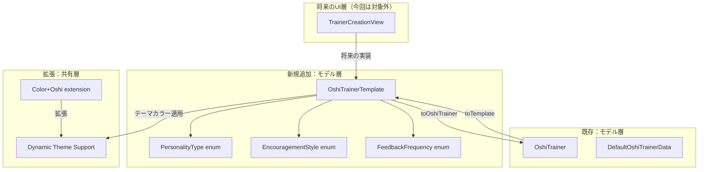

# 技術設計書：推しトレーナーテンプレート

## 概要

本機能は、将来の「推し作成機能」と「推しからのメッセージ機能（LLM統合）」の実装基盤として、推しトレーナーの入力項目をテンプレート化するデータモデル拡張を提供します。既存の`OshiTrainer`モデルを拡張し、性格・口調・音声・トレーニング応援スタイルなど14個の詳細パラメータを持つ`OshiTrainerTemplate`モデルを新規定義します。

**目的**: 推しトレーナーの詳細なカスタマイズパラメータを管理し、将来のUI実装とLLM統合の基盤を提供する。

**ユーザー**:
- アプリ開発者（データモデル定義と変換ロジックの実装者）
- 将来の推し作成機能UI実装者（このテンプレートを参照してフォーム設計を行う）

**影響範囲**:
- 既存の`OshiTrainer`モデルは変更せず、新規`OshiTrainerTemplate`モデルを追加
- 既存のデータサービス層（`DataServiceProtocol`, `MockDataService`）への影響なし
- 将来のUI実装時に`Color+Oshi`拡張の動的カラー対応が必要

### ゴール

- 推しトレーナー作成に必要な14個の入力項目を持つデータモデルを定義
- 既存`OshiTrainer`モデルとの双方向変換メソッドを提供
- 性格タイプ、応援スタイル、フィードバック頻度のプリセット値を列挙型で定義
- テーマカラーの動的UI適用に必要なインターフェースを設計

### 非ゴール

- UI実装（推し作成画面の実装は本設計の対象外）
- データ永続化層の実装（Core Data / UserDefaults統合は今後の課題）
- LLM統合の実装（LLMプロンプト生成ロジックは今後の課題）
- 音声アセット管理システムの実装（VOICEVOXキャラクター選択UIは今後の課題）

## アーキテクチャ

### 既存アーキテクチャの分析

現在のOshi-Trainerは、以下のMVVMアーキテクチャを採用しています：

```
Features/
├── Home/
│   ├── Views/HomeView.swift
│   └── ViewModels/HomeViewModel.swift
Models/
├── OshiTrainer.swift (既存)
├── DefaultOshiTrainerData.swift (既存)
Services/
├── DataServiceProtocol.swift (既存)
├── MockDataService.swift (既存)
└── DialogueTemplateProvider.swift (既存)
Shared/
└── Extensions/
    └── Color+Oshi.swift (既存、静的カラー定義)
```

**保持するアーキテクチャパターン**:
- MVVMパターン（View - ViewModel - Model/Service）
- プロトコル指向設計（`DataServiceProtocol`による抽象化）
- 機能別モジュール化（`Features/`ディレクトリ構造）

**保持する既存のドメイン境界**:
- `OshiTrainer`: 現在のトレーニングセッションで使用される推しトレーナーの実行時データ
- `OshiTrainerTemplate`: 推し作成時に保存される永続データ（新規追加）

**既存の統合ポイント**:
- `OshiTrainer`モデルは、`HomeViewModel`, `MockDataService`, `DefaultOshiTrainerData`で使用されている
- 新規`OshiTrainerTemplate`は、既存コードに影響を与えずに追加可能

### 高レベルアーキテクチャ



**アーキテクチャ統合**:
- **既存パターンの保持**: 既存の`OshiTrainer`モデルとその使用箇所は一切変更しない
- **新規コンポーネントの追加理由**:
  - `OshiTrainerTemplate`: 推し作成時の入力項目を管理する永続データモデル（14プロパティ）
  - 列挙型（`PersonalityType`等）: プリセット選択UIのためのタイプセーフなオプション定義
- **技術スタック整合性**: SwiftUI, Swift 6.x, Structベースのモデル設計を継続
- **ステアリング準拠**: `structure.md`のモデル命名規則（`{Entity}.swift`）、`tech.md`のSwiftUIファーストアプローチに従う

### 技術スタック整合性

本機能は、既存のOshi-Trainerの技術スタックを完全に踏襲します：

**フロントエンド**:
- SwiftUI（iOS 26+）
- Swift 6.x
- Structベースのデータモデル（値型、Identifiable, Codable準拠）

**新規依存関係**: なし（標準ライブラリのみ使用）

**既存パターンからの逸脱**: なし

### 主要設計判断

#### 設計判断1: OshiTrainerTemplateを独立した新規モデルとして定義

**決定**: `OshiTrainer`を拡張せず、独立した`OshiTrainerTemplate` structを新規作成する。

**コンテキスト**:
- 既存の`OshiTrainer`は、現在のトレーニングセッションで使用される実行時データ（6プロパティ）
- 推し作成機能では、14個の詳細パラメータ（性格説明、LLMプロンプト、応援スタイルなど）が必要
- 既存の`HomeViewModel`, `MockDataService`は`OshiTrainer`を使用しており、破壊的変更は避けるべき

**代替案**:
1. **OshiTrainerを拡張**: 既存モデルに8個の新規プロパティを追加
2. **継承による拡張**: `OshiTrainerTemplate: OshiTrainer`としてサブクラス化
3. **独立モデル + 変換メソッド（選択）**: 新規`OshiTrainerTemplate`を定義し、`OshiTrainer`との変換メソッドを提供

**選択したアプローチ**: 独立モデル + 変換メソッド

**理由**:
- **既存コードへの影響ゼロ**: `OshiTrainer`の使用箇所（`HomeViewModel`, `MockDataService`, `DefaultOshiTrainerData`）に一切影響を与えない
- **責任の明確な分離**: `OshiTrainer`（実行時データ）と`OshiTrainerTemplate`（永続データ）の役割を明確化
- **段階的実装**: UI実装前にモデル定義だけを先行できる

**トレードオフ**:
- **利得**: 既存コードの安定性、後方互換性の保証、段階的実装の柔軟性
- **代償**: モデル間の変換コードが必要（ただし、変換ロジックは単純なマッピング処理）

#### 設計判断2: 性格タイプ・応援スタイル等をString列挙型で定義

**決定**: `PersonalityType`, `EncouragementStyle`, `FeedbackFrequency`をString列挙型（`enum: String, CaseIterable`）として定義する。

**コンテキスト**:
- UIでのプリセット選択（Pickerなど）を想定
- LLM統合時のプロンプト生成でも使用
- 将来的な拡張性（新しい性格タイプの追加）を考慮

**代替案**:
1. **Stringのまま自由入力**: バリデーションなし、タイポのリスク
2. **Int列挙型**: 可読性低下、LLMプロンプトへの変換が煩雑
3. **String列挙型（選択）**: タイプセーフ、Pickerで使用可能、プロンプト生成が容易

**選択したアプローチ**: String列挙型

**理由**:
- **タイプセーフティ**: コンパイル時に不正な値を検出
- **UI統合の容易性**: `CaseIterable`により、Picker選択肢を自動生成可能
- **LLMプロンプト生成**: `rawValue`をそのままプロンプトに埋め込み可能

**トレードオフ**:
- **利得**: タイプセーフティ、コード補完、UI統合の簡潔性
- **代償**: 新しいプリセットを追加する際、列挙型の更新が必要（ただし、コンパイルエラーで検出可能なため、変更漏れのリスクは低い）

#### 設計判断3: テーマカラーをStringで保持し、動的Color変換をextensionで提供

**決定**: `themeColor`プロパティは`String`（例: "pink", "blue"）で保持し、`Color+Oshi` extensionに動的変換メソッドを追加する。

**コンテキスト**:
- 要件1.7-8: ホーム画面の背景グラデーション、ボタンアクセントカラー、各種画面のタイトルテキストにテーマカラーを適用
- 既存の`Color+Oshi`は静的カラー定義（`.oshiPink`, `.oshiGreen`など）
- 将来的にユーザー定義カラーの追加を想定

**代替案**:
1. **SwiftUIのColor型を直接保持**: Codableサポートが複雑
2. **RGB値を数値で保持**: 可読性低下、UIでの選択が煩雑
3. **String識別子 + 動的変換（選択）**: Codable対応、拡張性が高い

**選択したアプローチ**: String識別子 + 動的変換

**理由**:
- **Codable対応**: JSON/UserDefaultsへのシリアライズが容易
- **拡張性**: 新しいカラーを`Color+Oshi`に追加するだけで対応可能
- **デフォルト値の明確性**: "pink"などの文字列で直感的に理解可能

**トレードオフ**:
- **利得**: シリアライズの簡潔性、拡張性、可読性
- **代償**: 実行時に不正なカラー名が渡された場合のフォールバック処理が必要（デフォルト: `.oshiPink`）

## コンポーネントとインターフェース

### Models層

#### OshiTrainerTemplate

**責任と境界**
- **主要責任**: 推しトレーナー作成時に入力される14個のパラメータを管理する永続データモデル
- **ドメイン境界**: 推しトレーナーのテンプレート定義（推し作成機能、LLM統合の基盤）
- **データ所有権**: 推しトレーナーの全カスタマイズパラメータ（基本プロフィール、性格、LLM設定、音声、トレーニング設定）
- **トランザクション境界**: 単一の推しトレーナーテンプレート（アグリゲートルート）

**依存関係**
- **インバウンド**:
  - 将来の`TrainerCreationView`（推し作成UI）
  - 将来の`DataService`実装（Core Data / UserDefaults永続化）
- **アウトバウンド**:
  - `OshiTrainer`（変換メソッド経由）
  - `PersonalityType`, `EncouragementStyle`, `FeedbackFrequency`（列挙型）
- **外部依存**: なし（標準ライブラリのみ）

**契約定義**

**データモデル定義**:
```swift
struct OshiTrainerTemplate: Identifiable, Codable {
    // 識別子
    let id: UUID

    // 基本プロフィール（要件1）
    var name: String // 推しの名前（必須）
    var themeColor: String // テーマカラー識別子（例: "pink", "blue", "green"）
    var characterImage: String // キャラクター画像名またはURL

    // 性格・口調パラメータ（要件2）
    var personalityType: PersonalityType // 性格タイプ（列挙型）
    var firstPerson: String // 一人称（例: うち、私、俺）
    var secondPerson: String // 二人称（例: あんた、あなた、君）
    var personalityDescription: String // 性格説明（LLMプロンプト生成用）

    // LLM統合パラメータ（要件3、非リアルタイム用途）
    var llmPrompt: String // LLMへの振る舞い指示
    var referenceTone: String // 参考口調（LLM出力スタイル学習用）
    var prohibitedWords: [String] // 禁止ワードリスト

    // 音声・ボイスパラメータ（要件4）
    var characterVoice: String // キャラクターボイス（例: "ずんだもん", "四国めたん"）

    // トレーニング特化パラメータ（要件5）
    var encouragementStyle: EncouragementStyle // 応援スタイル（列挙型）
    var feedbackFrequency: FeedbackFrequency // フィードバック頻度（列挙型）
}
```

**事前条件**:
- `name`は空文字列でない（バリデーション必須）
- `themeColor`は有効なカラー識別子である（デフォルト: "pink"）
- `prohibitedWords`は重複なしの配列

**事後条件**:
- 保存後、`id`は不変
- `toOshiTrainer()`で`OshiTrainer`モデルへの変換が可能

**不変条件**:
- `id`は生成後変更不可
- `name`が空の状態で永続化されない（UIバリデーションで保証）

**変換メソッド**:
```swift
extension OshiTrainerTemplate {
    // OshiTrainerTemplateからOshiTrainerへの変換
    func toOshiTrainer(level: Int = 1, experience: Int = 0, currentDialogue: String = "") -> OshiTrainer {
        return OshiTrainer(
            id: self.id,
            name: self.name,
            level: level,
            experience: experience,
            imageName: self.characterImage,
            currentDialogue: currentDialogue
        )
    }

    // OshiTrainerからOshiTrainerTemplateへの変換（既存データの拡張時に使用）
    static func fromOshiTrainer(_ oshi: OshiTrainer, template: OshiTrainerTemplate? = nil) -> OshiTrainerTemplate {
        return OshiTrainerTemplate(
            id: oshi.id,
            name: oshi.name,
            themeColor: template?.themeColor ?? "pink",
            characterImage: oshi.imageName,
            personalityType: template?.personalityType ?? .cheerful,
            firstPerson: template?.firstPerson ?? PersonalityType.cheerful.defaultFirstPerson,
            secondPerson: template?.secondPerson ?? PersonalityType.cheerful.defaultSecondPerson,
            personalityDescription: template?.personalityDescription ?? "",
            llmPrompt: template?.llmPrompt ?? "",
            referenceTone: template?.referenceTone ?? "",
            prohibitedWords: template?.prohibitedWords ?? [],
            characterVoice: template?.characterVoice ?? "ずんだもん",
            encouragementStyle: template?.encouragementStyle ?? .balanced,
            feedbackFrequency: template?.feedbackFrequency ?? .medium
        )
    }
}
```

**状態管理**:
- **状態モデル**: Immutable（Structベース、値型）
- **永続化**: 将来的にCore DataまたはUserDefaultsで永続化（今回は対象外）
- **並行性**: 値型のため、コピーオンライトによる並行アクセスは安全

**既存システムとの統合戦略**:
- **変更アプローチ**: 新規モデル追加（既存`OshiTrainer`は変更なし）
- **後方互換性**: 既存の`OshiTrainer`使用箇所への影響ゼロ
- **移行パス**:
  1. `OshiTrainerTemplate`モデルを定義
  2. 将来のUI実装時に`TrainerCreationView`で使用
  3. 保存後、`toOshiTrainer()`で`OshiTrainer`に変換し、既存のデータフローに統合

#### PersonalityType（列挙型）

**責任と境界**
- **主要責任**: 性格タイプのプリセット定義とデフォルト値の提供
- **ドメイン境界**: 推しトレーナーの性格設定
- **データ所有権**: 性格タイプごとのデフォルト一人称・二人称

**契約定義**

**列挙型定義**:
```swift
enum PersonalityType: String, CaseIterable, Codable {
    case tsundere = "ツンデレ" // 例: 推乃 愛
    case cheerful = "元気" // デフォルト
    case kind = "優しい"
    case cool = "クール"

    // デフォルト一人称
    var defaultFirstPerson: String {
        switch self {
        case .tsundere: return "うち"
        case .cheerful: return "私"
        case .kind: return "私"
        case .cool: return "俺"
        }
    }

    // デフォルト二人称
    var defaultSecondPerson: String {
        switch self {
        case .tsundere: return "あんた"
        case .cheerful: return "あなた"
        case .kind: return "あなた"
        case .cool: return "お前"
        }
    }

    // デフォルトプロンプト生成（LLM統合時に使用）
    var defaultPrompt: String {
        switch self {
        case .tsundere:
            return "あなたはツンデレ性格の推しトレーナーです。表面的には冷たく接しますが、内心ではユーザーを大切に思っています。"
        case .cheerful:
            return "あなたは元気で明るい性格の推しトレーナーです。いつもポジティブにユーザーを応援します。"
        case .kind:
            return "あなたは優しく穏やかな性格の推しトレーナーです。ユーザーに寄り添い、励まします。"
        case .cool:
            return "あなたはクールで冷静な性格の推しトレーナーです。客観的なアドバイスを提供します。"
        }
    }
}
```

#### EncouragementStyle（列挙型）

**責任と境界**
- **主要責任**: トレーニング応援スタイルのプリセット定義
- **ドメイン境界**: トレーニングフィードバック戦略

**契約定義**

```swift
enum EncouragementStyle: String, CaseIterable, Codable {
    case strict = "厳しめ" // ストイックな指導
    case gentle = "優しめ" // 褒めて伸ばすスタイル
    case balanced = "バランス型" // デフォルト

    // テンプレートセリフ選択の重み（将来のDialogueTemplateProvider拡張用）
    var strictnessWeight: Double {
        switch self {
        case .strict: return 0.8 // 80%厳しめのセリフ
        case .gentle: return 0.2 // 20%厳しめ、80%優しめ
        case .balanced: return 0.5 // 50/50
        }
    }
}
```

#### FeedbackFrequency（列挙型）

**責任と境界**
- **主要責任**: トレーニング中のフィードバック頻度のプリセット定義
- **ドメイン境界**: トレーニングフィードバックタイミング戦略

**契約定義**

```swift
enum FeedbackFrequency: String, CaseIterable, Codable {
    case high = "高頻度" // レップごとにフィードバック
    case medium = "中頻度" // 5レップごと、デフォルト
    case low = "低頻度" // 10レップごと

    // フィードバック間隔（レップ数）
    var repInterval: Int {
        switch self {
        case .high: return 1
        case .medium: return 5
        case .low: return 10
        }
    }
}
```

### Shared層（拡張）

#### Color+Oshi extension（動的テーマカラー対応）

**責任と境界**
- **主要責任**: テーマカラー文字列から`Color`への動的変換
- **ドメイン境界**: UIテーマ設定
- **データ所有権**: カラーパレット定義とマッピングロジック

**依存関係**
- **インバウンド**: `HomeView`, `LevelDetailView`, `StatisticsView`等のUIレイヤー
- **アウトバウンド**: SwiftUIの`Color`型
- **外部依存**: なし

**契約定義**

**既存の静的カラー定義を保持しつつ、動的カラー変換メソッドを追加**:
```swift
extension Color {
    // 既存の静的カラー定義（変更なし）
    static let oshiBackground = Color(white: 0.95)
    static let oshiPink = Color(red: 1.0, green: 0.4, blue: 0.6)
    static let oshiGreen = Color.green
    // ... 他の既存カラー

    // 新規追加: テーマカラー識別子から動的にColorを取得
    static func oshiThemeColor(from identifier: String) -> Color {
        switch identifier.lowercased() {
        case "pink":
            return Color.oshiPink
        case "blue":
            return Color.blue
        case "green":
            return Color.oshiGreen
        case "orange":
            return Color.orange
        case "purple":
            return Color.purple
        default:
            return Color.oshiPink // デフォルトはピンク
        }
    }

    // グラデーション用の薄いバリエーション
    static func oshiThemeColorLight(from identifier: String) -> Color {
        return oshiThemeColor(from: identifier).opacity(0.6)
    }
}
```

**事前条件**:
- `identifier`は任意の文字列（大文字小文字を区別しない）

**事後条件**:
- 常に有効な`Color`を返す（不正な識別子の場合はデフォルトカラー）

**UI適用例**:
```swift
// ホーム画面の背景グラデーション（要件1.7）
LinearGradient(
    colors: [
        Color.oshiThemeColor(from: viewModel.themeColor).opacity(0.3),
        Color.oshiThemeColorLight(from: viewModel.themeColor).opacity(0.15),
        Color.clear
    ],
    startPoint: .bottom,
    endPoint: .top
)

// ボタンのアクセントカラー（要件1.7）
.foregroundColor(Color.oshiThemeColor(from: viewModel.themeColor))

// タイトルテキスト（要件1.8）
Text("統計")
    .foregroundColor(Color.oshiThemeColor(from: viewModel.themeColor))
```

## データモデル

### ドメインモデル

**コアコンセプト**:

- **アグリゲート**: `OshiTrainerTemplate`（推しトレーナーテンプレート全体）
- **エンティティ**: `OshiTrainerTemplate`（UUID識別子を持つ）
- **値オブジェクト**: `PersonalityType`, `EncouragementStyle`, `FeedbackFrequency`（不変な列挙型）
- **ドメインイベント**: なし（今回はデータモデル定義のみ）

**ビジネスルールと不変条件**:

1. **必須項目バリデーション**:
   - `name`は空文字列でない（UI側でバリデーション）
   - `themeColor`は有効な識別子である（存在しない場合はデフォルト"pink"）

2. **デフォルト値の自動設定**:
   - `personalityType`が未選択の場合 → `.cheerful`
   - `firstPerson`/`secondPerson`が空の場合 → `personalityType.defaultFirstPerson`/`defaultSecondPerson`を使用
   - `encouragementStyle`が未選択の場合 → `.balanced`
   - `feedbackFrequency`が未選択の場合 → `.medium`

3. **禁止ワードリストの一意性**:
   - `prohibitedWords`は重複なしの配列（UI側でSet化して保存）

**概念図**:

```mermaid
graph TB
    subgraph OshiTrainerTemplateアグリゲート
        Template[OshiTrainerTemplate]
        Template --> Name[name: String]
        Template --> ThemeColor[themeColor: String]
        Template --> CharacterImage[characterImage: String]
        Template --> PersonalityType[personalityType: PersonalityType]
        Template --> FirstPerson[firstPerson: String]
        Template --> SecondPerson[secondPerson: String]
        Template --> PersonalityDesc[personalityDescription: String]
        Template --> LLMPrompt[llmPrompt: String]
        Template --> ReferenceTone[referenceTone: String]
        Template --> ProhibitedWords[prohibitedWords: Array String]
        Template --> CharacterVoice[characterVoice: String]
        Template --> EncouragementStyle[encouragementStyle: EncouragementStyle]
        Template --> FeedbackFrequency[feedbackFrequency: FeedbackFrequency]
    end

    subgraph 値オブジェクト
        PersonalityTypeEnum[PersonalityType enum]
        EncouragementStyleEnum[EncouragementStyle enum]
        FeedbackFrequencyEnum[FeedbackFrequency enum]
    end

    Template -->|変換| OshiTrainer[OshiTrainer]
    PersonalityType --> PersonalityTypeEnum
    EncouragementStyle --> EncouragementStyleEnum
    FeedbackFrequency --> FeedbackFrequencyEnum
```



### 論理データモデル

**エンティティ関係**:

- `OshiTrainerTemplate` (1) ←→ (1) `OshiTrainer`（双方向変換）
- `OshiTrainerTemplate` (1) → (1) `PersonalityType`（列挙型参照）
- `OshiTrainerTemplate` (1) → (1) `EncouragementStyle`（列挙型参照）
- `OshiTrainerTemplate` (1) → (1) `FeedbackFrequency`（列挙型参照）

**属性と型**:

| 属性名 | 型 | 必須 | デフォルト値 | 説明 |
|--------|-----|------|--------------|------|
| `id` | UUID | ✓ | UUID() | 識別子 |
| `name` | String | ✓ | - | 推しの名前 |
| `themeColor` | String | ✓ | "pink" | テーマカラー識別子 |
| `characterImage` | String | ✓ | "default-trainer" | キャラクター画像名/URL |
| `personalityType` | PersonalityType | ✓ | .cheerful | 性格タイプ |
| `firstPerson` | String | ✓ | personalityType.defaultFirstPerson | 一人称 |
| `secondPerson` | String | ✓ | personalityType.defaultSecondPerson | 二人称 |
| `personalityDescription` | String |  | "" | 性格説明 |
| `llmPrompt` | String |  | personalityType.defaultPrompt | LLMプロンプト |
| `referenceTone` | String |  | "" | 参考口調 |
| `prohibitedWords` | [String] |  | [] | 禁止ワードリスト |
| `characterVoice` | String | ✓ | "ずんだもん" | キャラクターボイス |
| `encouragementStyle` | EncouragementStyle | ✓ | .balanced | 応援スタイル |
| `feedbackFrequency` | FeedbackFrequency | ✓ | .medium | フィードバック頻度 |

**参照整合性ルール**:
- `personalityType`, `encouragementStyle`, `feedbackFrequency`は列挙型のため、常に有効な値
- `themeColor`は文字列のため、`Color.oshiThemeColor(from:)`で動的バリデーション

### 物理データモデル（将来実装）

**今回は対象外**、将来のデータ永続化実装時に以下を検討：

**UserDefaults保存例**:
```swift
// Codable準拠により、JSONエンコードが可能
let encoder = JSONEncoder()
if let data = try? encoder.encode(template) {
    UserDefaults.standard.set(data, forKey: "oshi_trainer_template_\(template.id.uuidString)")
}
```

**Core Data統合例**:
- `OshiTrainerTemplateEntity`（Core DataエンティティとしてORM定義）
- `personalityType`、`encouragementStyle`、`feedbackFrequency`は`String`として保存（rawValue）

## エラーハンドリング

### エラー戦略

本機能は、データモデル定義とデフォルト値提供が中心であり、複雑なエラーハンドリングは不要です。将来のUI実装時に以下のバリデーションエラーを想定します。

### エラーカテゴリと対応

**ユーザーエラー（4xx相当）**:
- **必須項目未入力**: `name`が空の場合
  - **対応**: UIレベルでフィールドバリデーション、保存ボタンを無効化
  - **メッセージ**: "推しの名前を入力してください"

**システムエラー（5xx相当）**:
- 本機能では、システムエラーは発生しない（データ永続化は今後の実装）

**ビジネスロジックエラー（422相当）**:
- **不正なテーマカラー識別子**: 存在しないカラー名が指定された場合
  - **対応**: `Color.oshiThemeColor(from:)`でデフォルトカラー（pink）にフォールバック
  - **メッセージ**: なし（サイレントにデフォルト適用）

### モニタリング

**今回は対象外**（将来のUI実装時に検討）:
- 推し作成完了率のトラッキング
- デフォルト値の使用頻度分析（どの項目がよくカスタマイズされるか）

## テストストラテジー

### ユニットテスト

**Models/OshiTrainerTemplate.swift**:
1. `toOshiTrainer()`変換メソッドが正しくプロパティをマッピングすることを検証
2. `fromOshiTrainer()`変換メソッドが既存の`OshiTrainer`から`OshiTrainerTemplate`を生成できることを検証
3. `fromOshiTrainer()`でテンプレートがnilの場合、デフォルト値が正しく設定されることを検証

**Models/PersonalityType.swift**:
1. `defaultFirstPerson`が各性格タイプで正しい値を返すことを検証
2. `defaultSecondPerson`が各性格タイプで正しい値を返すことを検証
3. `defaultPrompt`が各性格タイプで空文字列でないことを検証

**Shared/Extensions/Color+Oshi.swift**:
1. `oshiThemeColor(from: "pink")`が`.oshiPink`を返すことを検証
2. `oshiThemeColor(from: "invalid")`がデフォルトカラー（`.oshiPink`）を返すことを検証
3. `oshiThemeColorLight(from:)`が透明度0.6の色を返すことを検証

### 統合テスト

**OshiTrainerTemplate ↔ OshiTrainer変換フロー**:
1. `OshiTrainerTemplate`を作成 → `toOshiTrainer()`で変換 → `OshiTrainer`のプロパティが正しいことを検証
2. 既存の`OshiTrainer`（`DefaultOshiTrainerData.oshiAi`）→ `fromOshiTrainer()`で変換 → デフォルト値が設定されたテンプレートが生成されることを検証

**PersonalityTypeとデフォルト値の連携**:
1. `personalityType = .tsundere`のテンプレートを作成 → `firstPerson`が"うち"、`secondPerson`が"あんた"になることを検証
2. `personalityType = .cheerful`のテンプレートを作成 → `firstPerson`が"私"、`secondPerson`が"あなた"になることを検証

### E2E/UIテスト（将来実装）

**今回は対象外**（将来の推し作成UI実装時に以下をテスト）:
1. 推し作成画面で全項目を入力 → 保存 → ホーム画面でテーマカラーが反映されることを検証
2. 性格タイプを選択 → 一人称・二人称がデフォルト値で自動入力されることを検証
3. 必須項目（name）を未入力 → 保存ボタンが無効化されることを検証

## 要件トレーサビリティ

| 要件 | 要件概要 | コンポーネント | インターフェース | 備考 |
|------|----------|---------------|-----------------|------|
| 1.1-3 | 基本プロフィール入力項目 | `OshiTrainerTemplate` | `name`, `themeColor`, `characterImage`プロパティ | UIは将来実装 |
| 1.4 | 名前未入力時のエラー | 将来のUI実装 | UIバリデーション | 今回は対象外 |
| 1.5 | テーマカラーデフォルト値 | `OshiTrainerTemplate` | `themeColor: String = "pink"` | イニシャライザでデフォルト設定 |
| 1.6 | キャラクター画像デフォルト値 | `OshiTrainerTemplate` | `characterImage: String = "default-trainer"` | イニシャライザでデフォルト設定 |
| 1.7 | ホーム画面UI要素へのテーマカラー適用 | `Color+Oshi` extension | `oshiThemeColor(from:)`, `oshiThemeColorLight(from:)` | UIは将来実装 |
| 1.8 | 各種画面タイトルへのテーマカラー適用 | `Color+Oshi` extension | `oshiThemeColor(from:)` | UIは将来実装 |
| 2.1-4 | 性格・口調パラメータ | `OshiTrainerTemplate`, `PersonalityType` | `personalityType`, `firstPerson`, `secondPerson`, `personalityDescription` | - |
| 2.5-6 | 性格タイプ・口調デフォルト値 | `PersonalityType` | `defaultFirstPerson`, `defaultSecondPerson` | 列挙型のcomputed property |
| 3.1-5 | LLM統合パラメータ | `OshiTrainerTemplate` | `llmPrompt`, `referenceTone`, `prohibitedWords` | LLM統合は将来実装 |
| 3.6 | LLM用途の限定 | 設計ドキュメント | - | 非リアルタイム用途のみ |
| 4.1-4 | 音声・ボイスパラメータ | `OshiTrainerTemplate` | `characterVoice` | 音声再生UIは将来実装 |
| 5.1-4 | トレーニング特化パラメータ | `OshiTrainerTemplate`, `EncouragementStyle`, `FeedbackFrequency` | `encouragementStyle`, `feedbackFrequency` | - |
| 5.5-6 | テンプレートセリフ選択・LLMプロンプト反映 | `EncouragementStyle`, `FeedbackFrequency` | `strictnessWeight`, `repInterval` | 将来のDialogueTemplateProvider拡張 |
| 6.1 | OshiTrainerTemplateモデル定義 | `OshiTrainerTemplate` | 14プロパティ定義 | - |
| 6.2 | OshiTrainerとの変換メソッド | `OshiTrainerTemplate` extension | `toOshiTrainer()`, `fromOshiTrainer()` | - |
| 7.1-3 | 推しトーク入力項目との対応関係 | 設計ドキュメント | - | 設計判断として文書化 |
