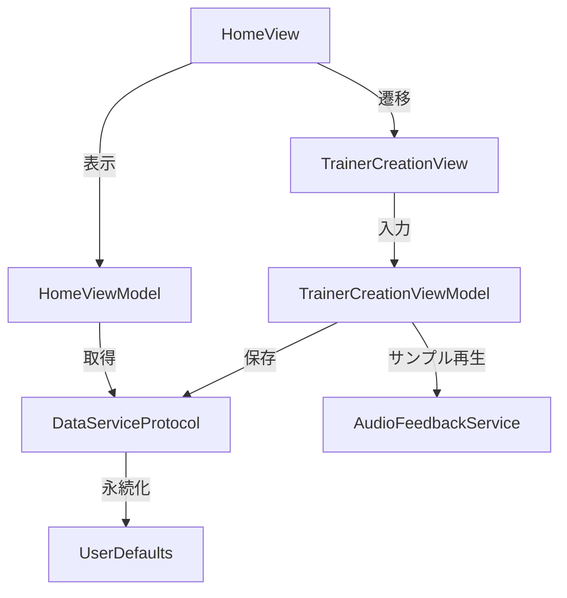
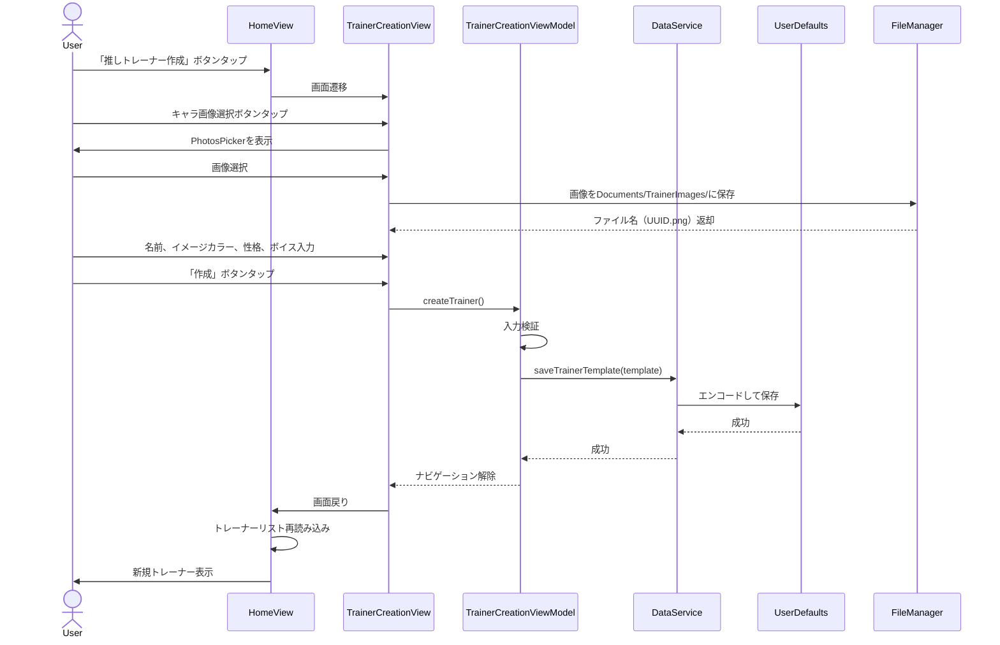
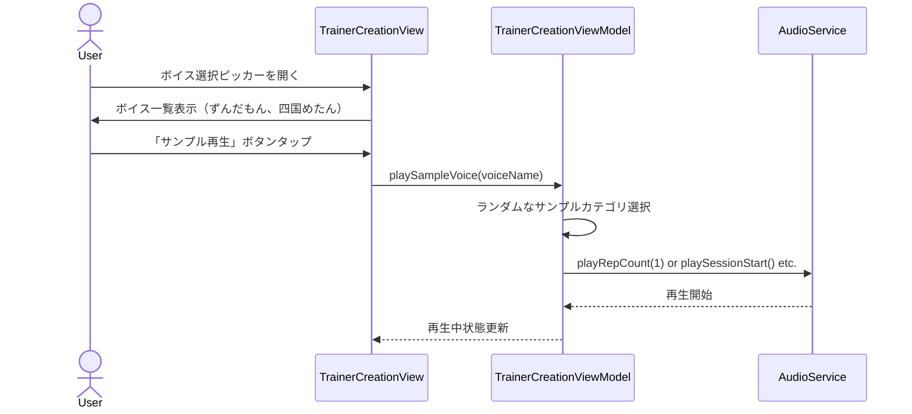
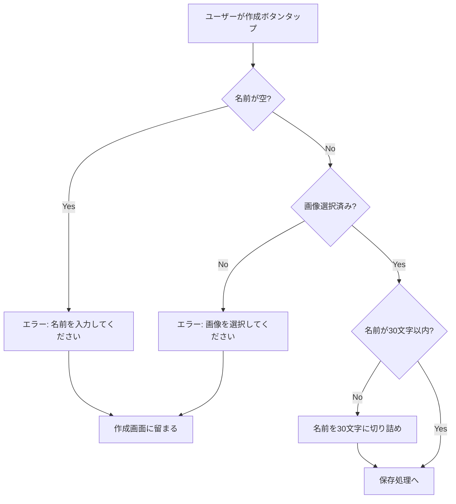

# 技術設計書: 推しトレーナー作成機能

## 概要

本機能は、ユーザーが独自の推しトレーナーを作成し、パーソナライズされたトレーニング体験を提供する機能です。ユーザーはキャラクター画像、名前、イメージカラー、性格、ボイスなどを設定でき、作成したトレーナーはホーム画面に表示され、UIテーマにイメージカラーが適用されます。

**目的**: ユーザーエンゲージメントとトレーニング継続率の向上を実現するため、パーソナライズされたトレーニングコンパニオンを作成可能にする。

**ユーザー**: トレーニングアプリのユーザーは、ホーム画面から推しトレーナー作成画面に遷移し、入力フォームを通じてトレーナーを作成する。

**影響**: 既存の`HomeViewModel`、`DataServiceProtocol`、`TrainerCreationView`を拡張し、トレーナーの永続化とホーム画面への反映を実現する。

### ゴール

- ホーム画面から推しトレーナー作成画面へのシームレスな遷移
- キャラクター画像、基本プロフィール、性格、ボイスの入力・選択機能
- 作成したトレーナーのローカルストレージへの保存
- 複数トレーナーの管理とスワイプ切り替え
- イメージカラーのUIテーマへの適用

### 非ゴール

- LLM統合による動的セリフ生成（将来機能）
- 外見カスタマイズ（髪型、服装、アクセサリー）の実装
- トレーナーの編集・削除機能（MVPでは作成のみ）
- サーバー連携によるトレーナー共有

## アーキテクチャ

### 既存アーキテクチャ分析

既存システムは以下のパターンで構成されています：

- **MVVM パターン**: View（SwiftUI）、ViewModel（ObservableObject）、Model/Service の分離
- **プロトコル指向設計**: `DataServiceProtocol`による抽象化
- **Feature-Based モジュール化**: `Features/`配下に機能別ディレクトリを配置
- **テンプレートシステム**: `OshiTrainerTemplate`による推しトレーナーの詳細情報管理

**保持すべき既存パターン**:
- `DataServiceProtocol`を通じたデータアクセス
- `Features/TrainerCreation/`ディレクトリ構造
- `OshiTrainerTemplate`モデルの利用
- ウマ娘風UIスタイル（`OshiButtonStyle`、`Color+Oshi`）

**統合ポイント**:
- `HomeViewModel`を拡張してトレーナーリスト管理機能を追加
- `DataServiceProtocol`に永続化メソッドを追加
- `TrainerCreationView`を完全実装

### 高レベルアーキテクチャ



### 技術整合性

本機能は既存技術スタックに完全準拠します：

**既存技術スタックとの整合**:
- Swift 6.x、SwiftUI、MVVM パターン
- `DataServiceProtocol`、`MockDataService`を拡張して永続化を実装
- `OshiTrainerTemplate`モデルをそのまま活用

**新規依存関係**:
- `PhotosUI`: 写真ライブラリからの画像選択（SwiftUI標準フレームワーク）
- `UserDefaults`: トレーナーデータの永続化（標準API）

**ステアリング準拠**:
- `structure.md`: `Features/TrainerCreation/Views/`, `Features/TrainerCreation/ViewModels/`に準拠
- `tech.md`: SwiftUI、MVVM、プロトコル指向設計に準拠
- `product.md`: テンプレートシステム基盤を活用したトレーナー作成機能

### 主要な設計決定

#### 決定1: UserDefaultsによる永続化

**決定**: トレーナーデータを`UserDefaults`に`Codable`でエンコード保存する

**コンテキスト**: MVP段階では複数トレーナー（10体程度）のローカル保存が必要。Core Dataは過剰、CloudKitは外部依存。

**代替案**:
1. **Core Data**: 構造化データの永続化に適しているが、セットアップコストが高い
2. **FileManager（JSON）**: 柔軟だが、エラーハンドリングとファイル管理が複雑
3. **UserDefaults（選択）**: 軽量、シンプル、`Codable`で簡単にエンコード可能

**選択したアプローチ**: `UserDefaults`を使用し、`[OshiTrainerTemplate]`を`JSONEncoder`でエンコードして保存

**根拠**:
- MVPでは10体程度のトレーナーデータで、データサイズは小さい（< 100KB）
- `Codable`準拠により実装がシンプル
- 将来的にCore DataやCloudKitへの移行が容易（DataServiceProtocol抽象化）

**トレードオフ**:
- **獲得**: 実装の簡潔性、迅速な開発、軽量な依存関係
- **犠牲**: 大規模データには不向き、クエリ機能なし、同期処理なし

#### 決定2: PhotosUIによる画像選択

**決定**: `PhotosPicker`（SwiftUI標準）を使用してデバイスの写真ライブラリから画像を選択

**コンテキスト**: ユーザーが既存の画像を推しトレーナーのキャラクター画像として選択する必要がある

**代替案**:
1. **UIImagePickerController（UIKit）**: UIViewControllerRepresentableでラップする必要がある
2. **PHPickerViewController（PhotosKit）**: iOS 14+で利用可能、UIKitベース
3. **PhotosPicker（SwiftUI、選択）**: iOS 16+、SwiftUIネイティブ、シンプルなAPI

**選択したアプローチ**: `PhotosPicker`を使用し、選択した画像を`UIImage`に変換してファイルシステムに保存

**根拠**:
- SwiftUIネイティブで、既存のSwiftUIコードベースと一貫性がある
- iOS 26をターゲットにしており、iOS 16+の要件を満たす
- プライバシー権限の自動処理

**トレードオフ**:
- **獲得**: SwiftUIとの統合の簡潔性、モダンなAPI、自動権限管理
- **犠牲**: iOS 16未満では使用不可（プロジェクトは既にiOS 26ターゲット）

#### 決定3: 画像保存戦略

**決定**: 選択された画像をアプリのDocumentsディレクトリに保存し、ファイル名を`OshiTrainerTemplate.characterImage`に記録

**コンテキスト**: ユーザーが選択した画像を永続化し、ホーム画面と詳細画面で表示する必要がある

**代替案**:
1. **Base64エンコードしてUserDefaultsに保存**: 実装は簡単だがデータサイズが大きく、UserDefaultsの制限に抵触する可能性
2. **アセットカタログに手動追加**: ビルド時にしか更新できず、動的追加不可
3. **Documentsディレクトリに保存（選択）**: ファイルシステムで管理し、パスを`characterImage`に保存

**選択したアプローチ**:
- 画像を`Documents/TrainerImages/`ディレクトリに`UUID.png`として保存
- `OshiTrainerTemplate.characterImage`にファイル名（`UUID.png`）を記録
- 表示時に`FileManager`から画像を読み込み

**根拠**:
- 画像データをUserDefaultsから分離し、軽量な永続化を維持
- 背景透過PNG画像をそのまま保存可能
- 将来的な画像最適化（リサイズ、圧縮）の余地を残す

**トレードオフ**:
- **獲得**: 軽量なUserDefaults、大きな画像ファイルのサポート、柔軟性
- **犠牲**: ファイル管理の複雑性、読み込みオーバーヘッド

## システムフロー

### ユーザーフロー: 推しトレーナー作成



### ボイスサンプル再生フロー



## 要件トレーサビリティ

| 要件 | 要件概要 | コンポーネント | インターフェース | フロー |
|------|---------|--------------|----------------|--------|
| 1 | 推しトレーナー作成画面への遷移 | `HomeView`, `TrainerCreationView` | `NavigationLink` | ユーザーフロー図 |
| 2 | キャラクター画像の選択 | `TrainerCreationView`, `PhotosPicker`, `ImagePersistenceService` | `selectImage()`, `saveImage()` | ユーザーフロー図 |
| 3 | 基本プロフィールの入力 | `TrainerCreationView`, `TrainerCreationViewModel` | `@State` bindings | ユーザーフロー図 |
| 4 | 性格の選択 | `TrainerCreationView`, `PersonalityType` | `Picker(selection:)` | ユーザーフロー図 |
| 5 | ボイスの選択とサンプル再生 | `TrainerCreationView`, `TrainerCreationViewModel`, `AudioFeedbackService` | `playSampleVoice()` | ボイスサンプル再生フロー図 |
| 6 | 推しトレーナーの作成と保存 | `TrainerCreationViewModel`, `DataServiceProtocol`, `UserDefaults` | `createTrainer()`, `saveTrainerTemplate()` | ユーザーフロー図 |
| 7 | ホーム画面への反映とイメージカラーの適用 | `HomeViewModel`, `HomeView` | `loadTrainerTemplates()`, `Color.oshiThemeColor()` | ユーザーフロー図 |
| 8 | 複数トレーナーの管理と表示順序 | `HomeViewModel` | `loadTrainerTemplates()`, `currentTrainerIndex` | ユーザーフロー図 |
| 9 | データモデルと既存システムとの統合 | `OshiTrainerTemplate`, `DataServiceProtocol` | `saveTrainerTemplate()`, `getAllTrainerTemplates()` | - |
| 10 | UIコンポーネントとスタイリング | `TrainerCreationView`, `OshiButtonStyle`, `Color+Oshi` | SwiftUI標準ビューとスタイル | - |

## コンポーネントとインターフェース

### プレゼンテーション層

#### TrainerCreationView

**責任と境界**
- **主要な責任**: 推しトレーナー作成画面のUI表示とユーザー入力の収集
- **ドメイン境界**: プレゼンテーション層（UI/UX）
- **データ所有権**: 入力フォームの一時的な状態（`@State`変数）
- **トランザクション境界**: N/A（ビューは状態管理のみ）

**依存関係**
- **Inbound**: `HomeView`（ナビゲーション遷移）
- **Outbound**: `TrainerCreationViewModel`（ビジネスロジック呼び出し）
- **External**: `PhotosUI`（画像選択）

**契約定義: SwiftUIビュー**

```swift
struct TrainerCreationView: View {
    @StateObject private var viewModel: TrainerCreationViewModel
    @Environment(\.dismiss) private var dismiss

    // 入力状態
    @State private var name: String = ""
    @State private var selectedImage: UIImage? = nil
    @State private var themeColor: String = "pink"
    @State private var personalityType: PersonalityType = .cheerful
    @State private var firstPerson: String = ""
    @State private var secondPerson: String = ""
    @State private var characterVoice: String = "ずんだもん"

    var body: View {
        // フォーム表示、画像選択、作成ボタン
    }

    // 検証: 名前が空でないこと、画像が選択されていること
}
```

**状態管理**
- **状態モデル**: 未入力 → 入力中 → 検証中 → 保存中 → 完了
- **永続化**: N/A（一時的な入力状態のみ、ViewModelが永続化を担当）
- **並行性**: メインスレッドのみ（SwiftUIビュー）

#### TrainerCreationViewModel

**責任と境界**
- **主要な責任**: トレーナー作成のビジネスロジック、入力検証、データ保存の調整
- **ドメイン境界**: プレゼンテーション層（ViewModel）
- **データ所有権**: 検証済みトレーナーデータ、エラー状態
- **トランザクション境界**: N/A（DataServiceに委譲）

**依存関係**
- **Inbound**: `TrainerCreationView`（ビューからの呼び出し）
- **Outbound**: `DataServiceProtocol`（データ永続化）、`ImagePersistenceService`（画像保存）、`AudioFeedbackService`（サンプル音声再生）
- **External**: なし

**契約定義: サービスインターフェース**

```swift
class TrainerCreationViewModel: ObservableObject {
    // Published プロパティ
    @Published var errorMessage: String? = nil
    @Published var isCreating: Bool = false

    // 依存関係
    private let dataService: DataServiceProtocol
    private let imagePersistenceService: ImagePersistenceService
    private let audioService: AudioFeedbackServiceProtocol

    // 主要メソッド
    func createTrainer(
        name: String,
        image: UIImage,
        themeColor: String,
        personalityType: PersonalityType,
        firstPerson: String?,
        secondPerson: String?,
        characterVoice: String
    ) async -> Result<OshiTrainerTemplate, TrainerCreationError>

    func playSampleVoice(voiceName: String)

    private func validateInput(
        name: String,
        image: UIImage?
    ) -> Result<Void, TrainerCreationError>
}

enum TrainerCreationError: Error {
    case nameEmpty
    case imageNotSelected
    case imageSaveFailed
    case dataSaveFailed
}
```

- **事前条件**: `name`が非空、`image`が非nil
- **事後条件**: トレーナーテンプレートがUserDefaultsに保存される、画像がDocumentsディレクトリに保存される
- **不変条件**: `isCreating`が`true`の間は再度呼び出し不可

### サービス層

#### DataServiceProtocol（拡張）

**責任と境界**
- **主要な責任**: トレーナーテンプレートの永続化と取得
- **ドメイン境界**: データアクセス層
- **データ所有権**: UserDefaultsに保存された全トレーナーテンプレート
- **トランザクション境界**: 個別の保存・取得操作（トランザクション不要）

**依存関係**
- **Inbound**: `TrainerCreationViewModel`, `HomeViewModel`
- **Outbound**: `UserDefaults`
- **External**: なし

**契約定義: プロトコル拡張**

```swift
protocol DataServiceProtocol {
    // 既存メソッド
    func getOshiTrainer() -> OshiTrainer
    func getLevelData() -> (level: Int, experience: Int, achievements: [Achievement])
    func getStatistics() -> (monthly: [MonthlyStatistic], category: [CategoryStatistic])

    // 新規メソッド
    func getAllTrainerTemplates() -> [OshiTrainerTemplate]
    func saveTrainerTemplate(_ template: OshiTrainerTemplate) -> Result<Void, DataServiceError>
    func getTrainerTemplate(by id: UUID) -> OshiTrainerTemplate?
}

enum DataServiceError: Error {
    case encodingFailed
    case decodingFailed
    case saveFailed
}
```

- **事前条件**: `saveTrainerTemplate`の場合、`template`が有効な`OshiTrainerTemplate`
- **事後条件**: テンプレートがUserDefaultsに保存される、`getAllTrainerTemplates()`で取得可能
- **不変条件**: 保存されたテンプレートのIDは一意

**統合戦略**
- **変更アプローチ**: プロトコル拡張（新規メソッド追加）
- **後方互換性**: 既存メソッドは変更なし、`MockDataService`と実装クラスに新規メソッドを追加
- **移行パス**: `MockDataService`にメモリ内実装を追加 → 本番実装でUserDefaults統合

#### ImagePersistenceService

**責任と境界**
- **主要な責任**: トレーナー画像のファイルシステムへの保存と読み込み
- **ドメイン境界**: データアクセス層（ファイルシステム）
- **データ所有権**: `Documents/TrainerImages/`ディレクトリ内の画像ファイル
- **トランザクション境界**: 個別の保存・削除操作

**依存関係**
- **Inbound**: `TrainerCreationViewModel`
- **Outbound**: `FileManager`
- **External**: `UIKit`（`UIImage`）

**契約定義: サービスインターフェース**

```swift
class ImagePersistenceService {
    // ディレクトリパス
    private let imageDirectory: URL

    init() throws {
        // Documents/TrainerImages/ ディレクトリを作成
    }

    // 画像を保存し、ファイル名（UUID.png）を返す
    func saveImage(_ image: UIImage) -> Result<String, ImagePersistenceError>

    // ファイル名から画像を読み込む
    func loadImage(fileName: String) -> UIImage?

    // 画像を削除
    func deleteImage(fileName: String) -> Result<Void, ImagePersistenceError>
}

enum ImagePersistenceError: Error {
    case directoryCreationFailed
    case imageConversionFailed
    case saveFailed
    case deleteFailed
}
```

- **事前条件**: `saveImage`の場合、`image`がPNG形式に変換可能
- **事後条件**: 画像が`Documents/TrainerImages/{UUID}.png`に保存される
- **不変条件**: ファイル名は常にUUID形式

### ドメイン層

#### HomeViewModel（拡張）

**責任と境界**
- **主要な責任**: 複数トレーナーのリスト管理、現在選択中のトレーナー管理
- **ドメイン境界**: プレゼンテーション層（ViewModel）
- **データ所有権**: トレーナーリスト、現在のインデックス
- **トランザクション境界**: N/A

**依存関係**
- **Inbound**: `HomeView`
- **Outbound**: `DataServiceProtocol`
- **External**: なし

**契約定義: 拡張メソッド**

```swift
class HomeViewModel: ObservableObject {
    // 既存プロパティ
    @Published var trainers: [OshiTrainer]
    @Published var templates: [OshiTrainerTemplate]
    @Published var currentTrainerIndex: Int

    // 新規メソッド
    func loadTrainerTemplates() {
        // DataServiceから全トレーナーテンプレートを取得
        // デフォルトトレーナー + ユーザー作成トレーナー + 推し追加プレースホルダー
        // 無限ループ用に3倍に拡張
    }

    func setActiveTrainer(at index: Int) {
        // インデックスを設定し、イメージカラーをUIに適用
    }

    // 無限ループ用の計算プロパティ
    var actualTrainerCount: Int {
        return trainers.count / 3
    }

    var currentTemplate: OshiTrainerTemplate {
        let actualIndex = currentTrainerIndex % actualTrainerCount
        return templates[actualIndex]
    }
}
```

**統合戦略**
- **変更アプローチ**: 既存メソッド`loadTrainers()`を拡張して`loadTrainerTemplates()`を呼び出す
- **後方互換性**: 既存のデフォルトトレーナー表示ロジックは維持
- **移行パス**: 既存の無限ループロジックを保持しつつ、ユーザー作成トレーナーを配列に追加

## データモデル

### ドメインモデル

#### 中核概念

**アグリゲート**:
- `OshiTrainerTemplate`: 推しトレーナーテンプレートのアグリゲートルート
  - `id`（UUID）による一意識別
  - 基本プロフィール、性格パラメータ、LLM統合パラメータ、音声パラメータを含む

**エンティティ**:
- `OshiTrainerTemplate`: 推しトレーナーの詳細情報を保持するエンティティ（既存）
- `OshiTrainer`: ホーム画面表示用の軽量トレーナー情報（既存）

**値オブジェクト**:
- `PersonalityType`: 性格タイプ（tsundere, cheerful, gentle, cool）
- `EncouragementStyle`: 応援スタイル（passionate, calm, balanced, protective）
- `FeedbackFrequency`: フィードバック頻度（minimal, medium, frequent, constant）

**ドメインイベント**:
- `TrainerCreated`: 新しいトレーナーが作成されたイベント（現時点では非実装、将来的に統計追跡に活用可能）

#### ビジネスルールと不変条件

**制約**:
- トレーナー名は必須（空文字列不可）
- `themeColor`は有効なカラー識別子（pink, blue, green, orange, purple）のいずれか
- `characterImage`は有効なファイル名または画像アセット名
- `personalityType`は`PersonalityType`列挙型のいずれか

**検証ルール**:
- 名前の長さ: 1〜30文字
- 画像ファイル: PNG形式、最大5MB
- デフォルト値の自動設定: `themeColor`（pink）、`personalityType`（cheerful）、`characterVoice`（ずんだもん）

**一貫性戦略**:
- 単一アグリゲート内の一貫性: `OshiTrainerTemplate`の全フィールドは同時に保存される
- 画像ファイルとテンプレートの一貫性: トランザクション境界なし（ベストエフォート、将来的に改善可能）

### 物理データモデル

#### UserDefaults（キーバリューストア）

**キー設計**:
- `trainerTemplates`: `[OshiTrainerTemplate]`の配列をJSONエンコード

**データ構造**:
```swift
// UserDefaultsに保存されるキー
let trainerTemplatesKey = "trainerTemplates"

// 保存形式
let templates: [OshiTrainerTemplate] = [...]
let encoder = JSONEncoder()
let data = try encoder.encode(templates)
UserDefaults.standard.set(data, forKey: trainerTemplatesKey)

// 取得形式
let decoder = JSONDecoder()
if let data = UserDefaults.standard.data(forKey: trainerTemplatesKey) {
    let templates = try decoder.decode([OshiTrainerTemplate].self, from: data)
}
```

**インデックス**: なし（配列の線形検索、トレーナー数が少ないため問題なし）

**制約**:
- UserDefaultsのデータサイズ制限（推奨: < 1MB、トレーナー10体で約50KB想定）

#### ファイルシステム

**ディレクトリ構造**:
```
Documents/
└── TrainerImages/
    ├── {UUID-1}.png
    ├── {UUID-2}.png
    └── {UUID-3}.png
```

**ファイル命名規則**:
- `{UUID}.png`: トレーナーIDに対応するUUID

**TTL**: なし（手動削除のみ、将来的にトレーナー削除機能で対応）

### データ契約と統合

#### API データ転送

現時点では外部APIとの統合は不要。将来的にサーバー連携を行う場合：

**リクエストスキーマ**:
```json
{
  "id": "UUID",
  "name": "推しトレーナー名",
  "themeColor": "pink",
  "characterImage": "base64EncodedImage",
  "personalityType": "tsundere",
  "firstPerson": "うち",
  "secondPerson": "あんた",
  "characterVoice": "ずんだもん"
}
```

**検証**: サーバー側でフィールド検証（必須フィールド、文字列長、列挙型）

**シリアライゼーション形式**: JSON

#### イベントスキーマ

現時点では非実装。将来的にイベント駆動アーキテクチャを導入する場合：

**公開イベント**:
```swift
struct TrainerCreatedEvent {
    let trainerId: UUID
    let createdAt: Date
}
```

**スキーマバージョニング**: イベントにバージョンフィールドを追加（将来対応）

**互換性**: 前方互換性（新しいフィールドは無視）、後方互換性（古いフィールドはデフォルト値）

## エラーハンドリング

### エラー戦略

本機能では以下のエラーハンドリングパターンを採用します：

- **ユーザーエラー**: 入力検証エラー → フィールドレベルのバリデーションメッセージ表示
- **システムエラー**: ファイルシステムエラー、永続化エラー → アラートダイアログで通知
- **ビジネスロジックエラー**: データ整合性エラー → ログ出力とデフォルト値への自動復旧

### エラーカテゴリと対応

#### ユーザーエラー（入力検証エラー）

| エラー種別 | 発生条件 | 対応策 | ユーザーへの通知 |
|-----------|---------|-------|----------------|
| 名前未入力 | `name`が空文字列 | 作成ボタンを無効化 | フィールド下に赤文字で「名前を入力してください」 |
| 画像未選択 | `selectedImage`がnil | 作成ボタンを無効化 | フィールド下に赤文字で「画像を選択してください」 |
| 名前が長すぎる | `name.count > 30` | 30文字で切り詰め | リアルタイムで文字数カウント表示 |

**検証フロー**:


#### システムエラー（インフラストラクチャエラー）

| エラー種別 | 発生条件 | 対応策 | ユーザーへの通知 |
|-----------|---------|-------|----------------|
| 画像保存失敗 | ファイルシステムエラー | リトライ（1回）、失敗時はアラート表示 | アラート「画像の保存に失敗しました。再度お試しください。」 |
| UserDefaults保存失敗 | エンコードエラー | ログ出力、アラート表示 | アラート「データの保存に失敗しました。」 |
| PhotosPicker起動失敗 | 権限拒否、システムエラー | アラート表示、設定画面へのリンク | アラート「写真へのアクセスが許可されていません。設定から許可してください。」 |

**リカバリー戦略**:
- 画像保存失敗: 1回リトライ、失敗時はユーザーに通知して作成画面に留まる
- UserDefaults保存失敗: ログ出力してアラート表示、作成画面に留まる

#### ビジネスロジックエラー

| エラー種別 | 発生条件 | 対応策 |
|-----------|---------|-------|
| デフォルト値の自動適用 | `themeColor`未選択 | デフォルト値（pink）を自動設定 |
| 性格タイプ未選択 | `personalityType`が未設定 | デフォルト値（cheerful）を自動設定 |
| 一人称・二人称未入力 | `firstPerson`または`secondPerson`が空 | 性格タイプに応じたデフォルト値を自動設定 |

### モニタリング

- **エラー追跡**: コンソールログ出力（開発環境）、将来的にCrashlyticsやSentryを統合
- **ログ**: `print("[ERROR] TrainerCreationViewModel: 画像保存失敗")`形式でログ出力
- **ヘルスモニタリング**: 現時点では非実装、将来的にトレーナー作成成功率を統計追跡

## テスティング戦略

### ユニットテスト

#### TrainerCreationViewModel
1. **入力検証テスト**: 名前未入力時に`TrainerCreationError.nameEmpty`を返すこと
2. **入力検証テスト**: 画像未選択時に`TrainerCreationError.imageNotSelected`を返すこと
3. **トレーナー作成成功**: 有効な入力で`createTrainer()`が成功し、`Result.success`を返すこと
4. **デフォルト値の自動設定**: `themeColor`未指定時にデフォルト値（pink）が設定されること
5. **サンプル音声再生**: `playSampleVoice("ずんだもん")`が`AudioFeedbackService`を正しく呼び出すこと

#### ImagePersistenceService
1. **画像保存成功**: 有効な`UIImage`を保存し、ファイル名（UUID.png）を返すこと
2. **画像保存失敗**: ディレクトリ作成失敗時に`ImagePersistenceError.directoryCreationFailed`を返すこと
3. **画像読み込み成功**: 保存した画像を正しく読み込めること
4. **画像削除成功**: ファイルを削除できること

#### DataServiceProtocol拡張（MockDataService）
1. **トレーナー保存成功**: `saveTrainerTemplate()`が成功し、`Result.success`を返すこと
2. **トレーナー取得成功**: `getAllTrainerTemplates()`が保存したテンプレートを返すこと
3. **エンコードエラー**: 無効なデータでエンコード失敗時に`DataServiceError.encodingFailed`を返すこと

### 統合テスト

#### TrainerCreationView + TrainerCreationViewModel + DataService
1. **エンドツーエンドのトレーナー作成**: ビューで入力 → ViewModelで検証 → DataServiceで保存 → HomeViewModelで取得
2. **画像選択から保存まで**: PhotosPickerで画像選択 → ImagePersistenceServiceで保存 → ファイル名がテンプレートに記録
3. **エラーハンドリング**: 名前未入力時にエラーメッセージが表示されること

#### HomeViewModel + DataService
1. **トレーナーリスト読み込み**: デフォルトトレーナー + ユーザー作成トレーナーが正しく読み込まれること
2. **無限ループ配列**: トレーナー配列が3倍に拡張され、中央グループから開始すること
3. **イメージカラー適用**: 現在のトレーナーのイメージカラーが`Color.oshiThemeColor()`で正しく取得されること

### UIテスト

#### 推しトレーナー作成フロー
1. **画面遷移**: ホーム画面の「推しトレーナー作成」ボタンタップで作成画面に遷移
2. **画像選択**: 「キャラ画像選択」ボタンタップでPhotosPickerが表示される
3. **入力フォーム**: 名前、イメージカラー、性格、ボイスが入力・選択可能
4. **作成ボタン**: 有効な入力時に「作成」ボタンがタップ可能、無効な入力時は無効化
5. **画面戻り**: 作成成功後にホーム画面に戻り、新規トレーナーが表示される

#### ホーム画面のトレーナー表示
1. **スワイプ切り替え**: 左右スワイプでトレーナーが切り替わる
2. **イメージカラー適用**: トレーナー切り替え時にUIカラーが更新される
3. **推し追加プレースホルダー**: 最後に「推し追加」画像が表示される

### パフォーマンステスト

本機能は軽量なデータ操作のみで、パフォーマンステストは現時点では不要。将来的にトレーナー数が100体を超える場合は以下を検討：

1. **トレーナーリスト読み込み**: 100体のトレーナーを読み込む際のパフォーマンス測定
2. **画像読み込み**: 複数の大きな画像ファイルの読み込みレイテンシ測定

## セキュリティ考慮事項

### プライバシーとデータ保護

- **写真ライブラリアクセス**: `Info.plist`に`NSPhotoLibraryUsageDescription`を追加し、ユーザーに明示的に権限を要求
- **ローカルデータ保護**: UserDefaultsとファイルシステムはアプリサンドボックス内に保存され、他アプリからアクセス不可
- **データ暗号化**: iOSのデフォルト暗号化（Data Protection）を活用（`NSFileProtectionComplete`）

### 脅威モデリング

| 脅威 | リスクレベル | 対策 |
|-----|------------|-----|
| 不正な画像ファイルのアップロード | 低 | PNG形式のみ許可、ファイルサイズ制限（5MB） |
| UserDefaultsの容量超過 | 低 | トレーナー数を制限（最大100体）、データサイズ監視 |
| ファイルシステムの容量超過 | 低 | 画像ファイルサイズ制限、定期的なクリーンアップ機能（将来実装） |

### コンプライアンス

- **GDPR/プライバシー**: ユーザーデータはローカルに保存され、外部送信なし
- **アプリストアレビュー**: `NSPhotoLibraryUsageDescription`を適切に記述し、プライバシーポリシーを明示

---

## 付録

### 技術用語集

- **PhotosPicker**: SwiftUIで提供される写真ライブラリ選択UI
- **UserDefaults**: iOSのキーバリューストア（軽量な設定データの永続化に使用）
- **Codable**: Swiftのエンコード/デコードプロトコル
- **OshiTrainerTemplate**: 推しトレーナーのテンプレートモデル（既存）

### 参考資料

- [PhotosUI - Apple Developer](https://developer.apple.com/documentation/photosuit)
- [UserDefaults - Apple Developer](https://developer.apple.com/documentation/foundation/userdefaults)
- [Data Protection - Apple Developer](https://developer.apple.com/documentation/uikit/protecting_the_user_s_privacy)
